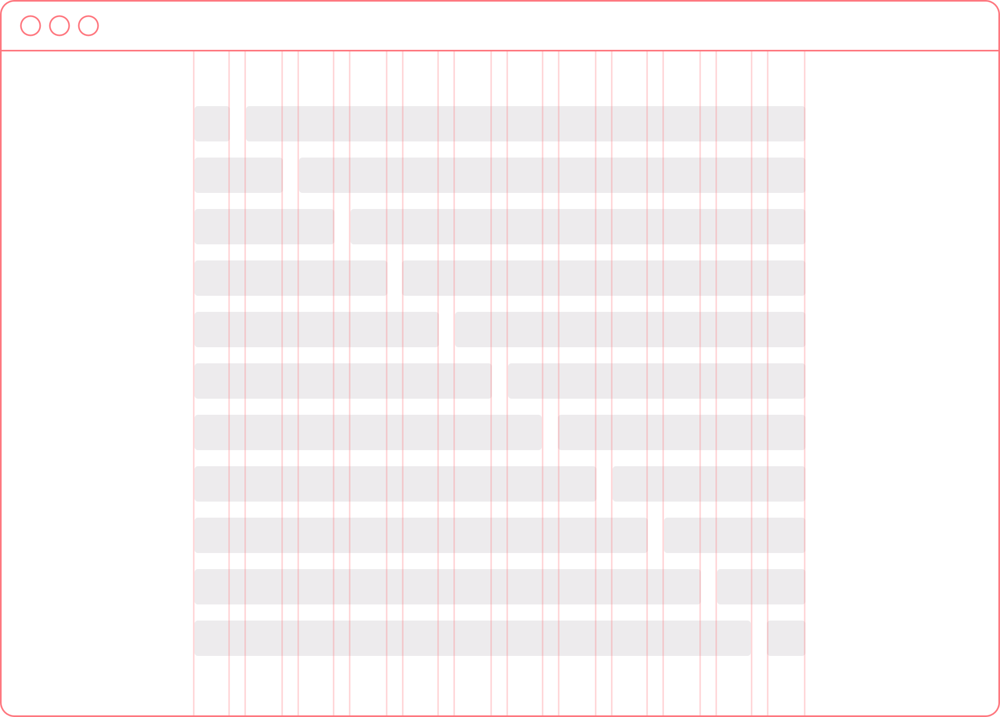

autoscale: true
footer: © New York Code + Design Academy 2016
slidenumbers: true

#[fit] Grid<br>Systems

---

# What is a grid system?
### (as it relates to design)

A framework of intersecting lines meant to be used as a skeleton to arrange different graphic elements



---

# What is a grid system?
### (as it relates to CSS + web design)

- Rather than arbitrarily deciding how large content blocks on a web page should be, have them conform to a set width

- Going further, instead of a set width for each block, decide on a width unit and make certain blocks x number of that unit wide

- Makes for more symmetrical designs and easier to maintain, more easily responsive code

---

### Grid-only Frameworks

* [SimpleGrid](http://www.simplegrid.io/)
* [Pills](http://arkpod.in/pills/)

### Large Frameworks w/ Grids

* [Skeleton](http://getskeleton.com/)
* [Bootstrap](http://getbootstrap.com)
* [Zurb Foundation](http://foundation.zurb.com)

---

# Using a Grid System

- Grid systems provide classes for you to use to size columns

- Classes used are not semantic like custom ones, they're prescriptive

- You must include the library before your custom styles

- Read the documentation! Every grid system is different, though most are 12 column.

---

# Using a Grid System (Pills)

- Columns contained in `.row` class elements

- Classes can either be semantic sizes, or 1-12 numbers.

```html
<div class="row">
   <div class="two-third">2/3</div>
   <div class="one-thirds">1/3</div>
</div>

<div class="row">
  <div class="eight">Eight</div>
  <div class="four">Four</div>
</div>
```

---

# Using a Grid System (Bootstrap)

* Some grid systems allow you to define responsive behavior
* They might also have extra classes that allow for different behavior
[link](http://codepen.io/anon/pen/ZeoNwY)

```html
<div class="row">
  <div class="col-12 col-sm-8">
    <!-- Full width at mobile, 2/3 above the small breakpoint -->
  </div>
  <div class="col-12 col-sm-4">
    <!-- Full width at mobile, 2/3 above the small breakpoint -->
  </div>
</div>
```

---

# Exercise

Create the webpage mocked up in the file bootstrap.png using Bootstrap's fluid grid system

---

# Mixin Frameworks

- Using SASS, we can make grids using mixins instead

- Keeps CSS in charge of display, and your classes semantic

### Frameworks

* [Neat](http://neat.bourbon.io/)
* [Bootstrap (Mixins)](https://github.com/twbs/bootstrap/blob/v4-dev/scss/mixins/_grid.scss)
* [Make your own mixin!](http://thesassway.com/intermediate/simple-grid-mixins)

---

# Mixin Frameworks (Neat)

```html
<!-- HTML -->
<div class="content">
  <main class="content-main"></main>
  <aside class="content-sidebar"></aside>
</div>
```

```scss
// SCSS
@import "neat";
.content {
  &-main {
    @include grid-column(9);
  }

  &-sidebar {
    @include grid-column(3);
  }
}
```
