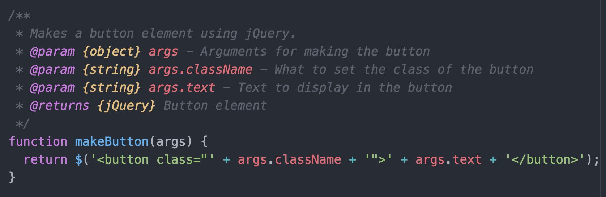

# [fit]JSDoc

### Because people need to know what<br/>the f*%$ is going on in your code

---

# What is JSDoc?

* A standard for writing comments that indicate how functions, attributes, and classes work
* Documents the "contract" of what inputs you need, outputs you provide
* Can be used to generate sweet documentation pages

---

# Example - Function

```js
/**
 * This is a description of the function
 * @param {varType} varName - This is a description of this argument
 * @returns {varType} - This is a description of the return value
 */
function fncName(varName) {
	// Whatever this function does using varName...
	return varName;
}
```

---

# Example - Function (cont.)

```js
/**
 * Given a number, return a string representation of that number. Function only
 * handles numbers greater than zero, and returns a default string for numbers
 * above 3.
 * @param {number} num - The number to be converted
 * @returns {string} - String representation of `num`
 */
function numberToWord(num) {
	if (number === 1) {
		return "one";
	} else if (number === 2) {
		return "two";
	} else if (number === 3) {
		return "three";
	} else {
		return "some big ol' number";
	}
}
```

---

# Example - Object arguments

As we've seen, some of our arguments are objects that we rely on having certain keys. We can enumerate these as well:

```js
/**
 * Makes a button element using jQuery.
 * @param {object} args - Arguments for making the button
 * @param {string} args.className - What to set the class of the button
 * @param {string} args.text - Text to display in the button
 * @returns {jQuery} Button element
 */
function makeButton(args) {
	return $('<button class="' + args.className + '">' + args.text + '</button>');
}
```

---

# Example - Singleton

Singletons are also sometimes referred to as a "Namespace", meaning a way to refer to methods and data under one name.

```js
/**
 * A singleton that holds all of my functionality.
 * @namespace
 * @property {array} myProperty - An array that holds some data or something
 */
var MySingleton = {
	myProperty: [],

	/**
	 * Function description, just like shown before.
	 * @returns {string} Just says "woohoo"
	 */
	myFunction: function() {
		return "woohoo";
	},
};
```

---

## Your syntax highlighter loves JSDoc too!



---

# Final notes

* JSDoc is not required, but encouraged. Employers will be impressed at well documented code.
* Make sure that _your docs are accurate_. The only thing more harmful than no documentation is incorrect documentation!
* If your function uses the `return` statement, you must provide an `@returns`. If it does not, you should not either.
* Your linter will warn you of invalid jsdoc from the `valid-jsdoc` rule, so be sure to fix those.
