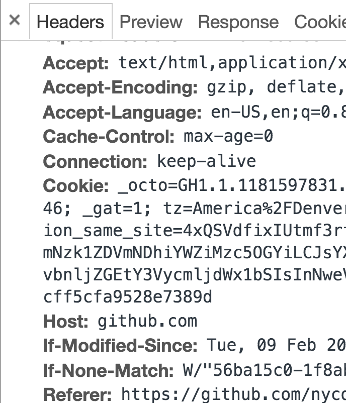

autoscale: true
footer: © New York Code + Design Academy 2017
slidenumbers: true

# HTTP Protocol

---

# Agenda

* Anatomy of an HTTP Request
* Content Types
* Status Codes
* JSON Responses

---

## Prework

* Download and install Postman on your computer.
* This will be the application we use to make http requests.

---

## HTTP Definition

* Hyper Text Transfer Protocol
* The protocol that allows:
* a client to make requests for information.
* a webserver to communicate information over the internet.

![right fit] (./resources/images/http1-request-response.png)

---

## Thought Exercise

* Imagine you're responsible for taking coffee orders from your classmates, but...
    * You can't speak to each other, orders have to be written down.
    * There is one classmate responsible for passing the order to you.
    * Your classmates will need to place, modify, remove and get the list of their orders.

How would you approach this problem?

---

## Protocol

* Communication between a client and server faces a similar problem.
* This is why certain rules were established to make this process more streamlined.
* These rules are the HTTP protocol and they dictate:
    * How a request needs to be made to a web server.
    * How a response will be communicated back to the client making the request.

---

## Anatomy of an HTTP Request

* URL
* Method
* Headers
* Body

---

## URL - Uniform Resource Locator

"nycda.com/courses/be-101?section=2"

* Anatomy of a URL
    * Has a host (nycda.com)
    * Has a path (/courses/be-101)
    * Sometimes has a query (?section=2)
    * Sometimes has some other parts too
* The URL is like an address on an envelope
* It refers to a "resource" located on the server.

---

## URL Encoding

* There are some characters that aren't allowed inside URLs (eg space characters)
* But there are times when we need to use these characters in the URL.
* URL Encoding takes these "unsafe" characters and transforms them into a "safe" representation.
* Safe characters:
    * abcdefghijqlmnopqrstuvwxyz ABCDEFGHIJQLMNOPQRSTUVWXYZ
    * 1234567890
    * $ - _ .  * ' ( ) ,

* Unsafe characters will need to be "encoded"
    * space, !, ", #, %, &
    * eg: " => %22

Resource:
[http://www.blooberry.com/indexdot/html/topics/urlencoding.htm](http://www.blooberry.com/indexdot/html/topics/urlencoding.htm)

---

## HTTP Method

Request Method

* Specifies the kind of operation is the client asking the server to perform.
* GET, POST, PUT, DELETE (... and PATCH, OPTIONS, LINK ...)
    * GET: Give me information about the resource indicated by this URL
    * PUT: Update the resource with the information I'm giving you now
    * POST: Make a change related to this resource (usually make a new one)
    * DELETE: Remove the resource specified

Note that the server can choose to ignore requests.

---

## Example - HTTP Method

Describe what HTTP method one might use to make the following requests in a browser:

* Create a coffee order
* Modify an existing coffee order
* Cancel a coffee order
* List all the coffee orders

---

## Headers

* Contain additional information about the request/response.
* The information is communicated via a "key:value" pair.
* Both Requests and Responses contain information in the headers section.



---
## Body

* For POST or PUT requests the body contains data that is being sent to the server.
* This could be:
    * the names/values of the form elements
    * some json data
    * binary data if uploading an image or file.

---

## HTTP Body Example
```
// Example JSON Body
{"employees":{"employee":[{"id":"1","firstName":"Tom",
"lastName":"Cruise"},{"id":"2","firstName":"Maria",
"lastName":"Sharapova"}]}}

// Example Form Data
-----------------------------9051914041544843365972754266
Content-Disposition: form-data; name="name"

tom ford
-----------------------------9051914041544843365972754266
Content-Disposition: form-data; name="age"

12

-----------------------------9051914041544843365972754266--
```

---

## Exercise

* Use Postman to make a request to
    * [http://facebook.com/login] (http://facebook.com/login)
    * What do you get back?
    * What kind of resource is this?

* Using Postman, make another request to
    * [https://goo.gl/xipLSq](https://goo.gl/xipLSq)
    * What do you get back?
    * What do you think this type of resource is?

---

## Content Types

* This is information that is passed in the header that dictates the desired/available content-type.
* When passing the content-type in the request, the client is asking for the data in a certain format
* When passing the content-type in the response, the server is dictating what the response is.
* The browser will then take the appropriate action based on the response's content type.

---

## Common Types

'Type/Subtype'

* text/html     => HTML text resource
* text/plain    => Plain text resource
* image/png     => .png image resource
* image/jpg     => .jgp image resource
* video/mp4     => mp4 video resource
* application/json  => binary json resource


Source:
[MIME types - HTTP | MDN](https://developer.mozilla.org/en-US/docs/Web/HTTP/Basics_of_HTTP/MIME_types)

---

## Request Messages

```
[method] [URL] [version]
[headers]
[body]

example:

GET /login/ HTTP/1.1
Host: www.facebook.com

```

---

## Response Message

```
[version] [status] [reason]
[headers]
[body]

example:

HTTP/1.1 200 OK
content-type: text/html

<html>
    ... content ...
</html>
```

---

## Status Codes

* 100-199   =>  Informational
* 200-299   =>  Successful
* 300-309   =>  Redirect
* 400-499   =>  Client Error
* 500-599   =>  Server Error

Example:
[https://github.com/404](https://github.com/404)

Source:
[HTTP response status codes - HTTP | MDN](https://developer.mozilla.org/en-US/docs/Web/HTTP/Status)

---

## Exercise

* Make a request to [http://www.omdbapi.com/?t=limitless&plot=short](http://www.omdbapi.com/?t=limitless&y=&plot=short)
* Identify the Request Method
* Identify the Response content-type
<br>

* Make these requests in your browser and take note of the behavior
