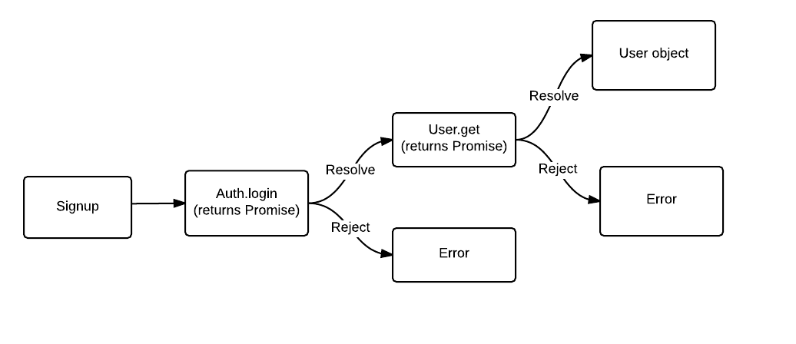

autoscale: true
slidenumbers: true

# [fit] Promises

---

# Prerequisite: setTimeout

There's a handy function in javascript that allows us to delay running code by some number of milliseconds known as `setTimeout`. It takes in a function, and executes it after some time:

```js
console.log("Run immediately");
setTimeout(function() {
  console.log("Run in one second");
}, 1000);
```

---

# Prerequisite: Try / Catch / Errors

Those red console errors we've been running in to don't have to totally destroy your code, we can manage them by wrapping them in a `try` block, and handling the errors in a subsequent `catch` block. This will catch any and all `Error` objects that are thrown while running that code.

---

# Prerequisite: Try / Catch / Errors
#### The problem

```js
/**
 * Parses JSON and returns an object. If the JSON is errorous,
 * return an empty object anyway.
 * @param {string} json - Stringified JSON that represents an object.
 * @returns {object} The json as a JS object
 */
function jsonToObject(json) {
  return JSON.parse(json);
}

// This will throw the following error:
// SyntaxError: Unexpected token s in JSON at position 1
jsonToObject('{some: "json"}');
```

---

# Prerequisite: Try / Catch / Errors
#### Solution to errors

```js
function jsonToObject(json) {
  try {
    return JSON.parse(json);
  }
  catch (err) {
    console.error("Unable to parse JSON object string, returning empty object", err);
    return {};
  }
}

// Returns an empty object, and logs the issue to the console.
jsonToObject('{some: "json"}');
```

---

# Prerequisite: Try / Catch / Errors
#### Custom error throwing

```js
function jsonToObject(json) {
  try {
    var obj = JSON.parse(json);

    // Make sure it's an object, not an array or int or string etc.
    if (obj && typeof obj === "object" && !Array.isArray(obj)) {
      return obj;
    }
    else {
      throw new Error("JSON must represent an object, not other data types");
    }
  }
  catch (err) {
    console.error("Unable to parse JSON object string, returning empty object", err);
    return {};
  }
}

// Returns an empty object, and logs the issue.
jsonToObject('true');
```

---

# What is a Promise

> A Promise represents a proxy for a value not necessarily known when the promise is created. It allows you to associate handlers to an asynchronous action's eventual success value or failure reason. This lets asynchronous methods return values like synchronous methods: instead of the final value, the asynchronous method returns a promise of having a value at some point in the future. [^1]

[^1]: Mozilla Developer Network

---

# In other words...
- Allows you to create functions that return a value that does not exist yet (Requires network request, user input etc.)
- Gives you a way to create easy to read asynchronous code
- Wraps asynchronously executing code into chains of function calls to make things more legible
- Simplifies error handling and error bubbling

---

# Promise States
- Promises can exist in one of three states:
    - `pending`: The initial state of a Promise upon creation.
    - `fulfilled`: The pending operation has completed successfully.
    - `rejected`: The pending operation failed.

---

# Other Terminology You Might See
- resolved: a promise that has fulfilled a value
- settled: a promise that has either been fulfilled or rejected

---

# Creating a Promise
- New promises take a function that has two function arguments - resolve and reject
- Promise functions are intended to do some work, _eventually_ calling resolve or reject

```js
var promise = new Promise(function(resolve, reject) {
  // perform an action
  // this could be any synchronous or asynchronous operation

  if (someError) {
    // if there was an error
    reject(someError);
  }
  else {
    // if everything went well
    resolve(asyncResult);
  }
});
```

---

# Creating a Promise: AJAX

```js
var promise = new Promise(function(resolve, reject) {
  $.ajax({
    url: "google.com",
    success: function(res) {
      resolve(res);
    },
    error: function(xhr, err) {
      reject(err);
    },
  })
});
```

---

# Using a Promise: `promise.then()`
- All promise instances have a `.then()` method that allow you to handle promise resolution
- The `.then()` function takes a callback as an argument, much like `setTimeout` or the ajax `success` argument
- Once the previous promise `resolve`s, that value is then passed to the `.then()` callback

---

# Example: `promise.then()`

```js
// create a promise
var promise = new Promise(function (resolve, reject) {
  setTimeout(function() {
    // resolve the promise with a message after waiting the second
    resolve('hello world!');
  }, 1000);
});

promise.then(function(result){
  // prints "hello world!" after 1 second
  console.log(result);
});
```

---

# Using a Promise: `promise.catch()`
- All promise instances also get a `.catch()` method that allow you to handle promise rejection
- The `.catch()` method behaves exactly the same as the `catch` seen in try / catch blocks
- It's passed a callback function that receives the result given by what was passed to the promise's `reject`
- Typically, `.catch()` is called with an `Error` object

---

# Example: Using `promiseInstance.catch()`

```js
var promise = new Promise(function (resolve, reject) {
  setTimeout(function() {
    // Resolve all fine after a second...
    resolve("Nice work");
  }, 1000);

  // But oh no, an error was hit before that setTimeout
  // fired, so reject. The resolve will be ignored.
  reject(new Error('uh oh!'));
});

promise.then(function(res) {
  console.log("This code will never execute!");
})
.catch(function(err){
  console.error("Something went wrong", err);
});
```

---

# Using a Promise: `Promise.resolve()`
- Instead of creating an asynchronous Promise, you can use the static method `Promise.resolve()` to fulfill values immediately
- Makes a Promise that is already resolved to the value you pass, so it executes immediately
- But works with the same code asynchronous code, so it still behaves with `.then()`

---

# Example: Using `Promise.resolve()`

```js
function search(text) {
  // We know no text = no results, so just return immediately
  if (!text) {
    return Promise.resolve([]);
  }

  // Otherwise, do the search for real
  return new Promise(function(resolve, reject) {
    $.ajax({
      url: "/my/search/endpoint",
      data: { text: text },
      success: function(res) { resolve(res); },
    });
  });
}

// Immediately prints out `[]`
search().then(console.log);
// Prints out search results after an HTTP request
search().then(console.log);
```

---

# Using a Promise: `Promise.reject()`
- Again, instead of creating a Promise, you can use the static method `Promise.reject()`to create a rejected Promise immediately
- Like `.resolve()`, this creates a promise that is already in a rejected state, passing the error

---

# Example: Using `Promise.reject()`

```js
function search(text) {
  // We require that search text be sent, so error if it's not
  if (!text) {
    return Promise.reject(new Error("must search using text"));
  }

  // Otherwise, do the search for real
  return new Promise(function(resolve, reject) {
    $.ajax({
      url: "/my/search/endpoint",
      data: { text: text },
      success: function(res) { resolve(res); },
      error: function(xhr, err) { reject(err); },
    });
  });
}

// Immediately prints out the "no text" error
search().then(console.log).catch(console.error);
// Prints out search results or an error after an HTTP request
search().then(console.log).catch(console.error);
```

---

# Function Composition/Chaining
- `.then()` and `.catch()` both return Promises
- This means that the return values can call `.then()` and `.catch()` as well, chaining the methods together in an operation known as composition
- Chaining allows Promises to allow for more complex behavior
- Note that values must be returned from the `.then()` handler
- Returned values can be promises or any other object, function, or primitive

---

## Example: Chained `.then()` calls

```js
var promise = new Promise(function(resolve) {
  // Resolves with 2, passing that to the next function
  resolve(2);
})
.then(function(num) {
  // Receives 2, returns 200
  return num * 100;
})
.then(function(num) {
  // Receives 200, returns 100
  return num / 2;
})
.then(function(num) {
  // Logs out "The result is 100".
  console.log("The result is " + num);
});
```

---

## Example: Chained `.then()` calls (AJAX)

```js
var promise = new Promise(function(resolve) {
  // First, retrieve the song url from our API
  $.ajax({
    url: "songapi.com/search-song",
    data: { title: "Thriller" },
    success: function(res) {
      resolve(res.songUrl);
    },
  });
})
.then(function(songUrl) {
  // Then load the song, and resolve when it's fully loaded
  return new Promise(function(resolve, reject) {
    var audio = new Audio(songUrl);
    audio.addEventListener("canplaythrough", function() {
      resolve(audio);
    });
  });
})
.then(function(song) {
  // Finally, play the dang song!
  song.play();
});
```

---

# Example Promise Graph



---

# jQuery and Promises

- jQuery uses its own flavor of promises, called `Deferred` objects
- They have the same methods as regular promises (`.then()`, `.catch()`)

---

# jQuery Promise Example

```js
// This callback style code...
$.ajax({
  url: "<url>",
  success: function() { /* ... */ },
  error: function() { /* ... */ },
});

// Is identical to this promise style code
$.ajax({ url: "<url>" }).then(function() {
  /* ... */
})
.catch(function() {
  /* ... */
});
```

---

# Resources

- [Google's Primer on Promises](https://developers.google.com/web/fundamentals/getting-started/primers/promises)
- [jQuery's Deferred Object docs](https://api.jquery.com/category/deferred-object/)
