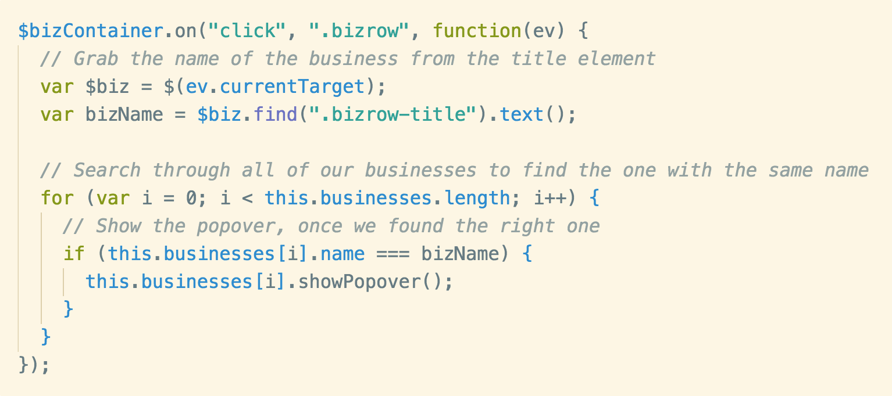

# jQuery's `data()` function

---

# The Problem

* Sometimes our DOM elements are just visual representations of data in our application
* A picture and some text could represent a person's profile, a video, an item to purchase etc
* When a user interacts with that DOM element, we may need to reference the data it represents
* But how can our event listeners link the DOM element back to the data?

---

# Example: Popover item

We have a small row item for various businesses. Each of those rows corresponds to a `BusinessRow` class instance. When a user clicks on the business row, we want to show a popover with more information. However, we only want one popover open at a time.


---

### Incorrect solution: Use DOM Info

A first attempt at this might have you using some information found in the DOM, in this case, the title of the business from an element. This doesn't work well because any changes to the DOM layout, or the content inside, could cause this code to break.



---

### Incorrect solutions: Handle the event in the class

* In many cases, what you'd want to do is put the event listener inside the class
* That way, you could just call `this.openPopover()` and not need to find the instance
* But remember the requirement, "we only want one popover open at a time"?
* We'd need to close any other open popovers, which would break encapsulation.

---

## Correct solution: jQuery's `data()`

* jQuery objects have a `data()` function that takes in one or two arguments.
* If you call it with two arguments, `$el.data("name", value)`, you'll set a `value` on an element that can be accessed at `"name"`.
* If you call it just with `$el.data("name")`, you'll get the value you set earlier.

---

## Correct solution: jQuery's `data()`

```js
class BusinessRow {
	constructor() {
		// Create the bizrow element, and assign this instance
		// of the class to the "business" jQuery data key
		this.$el = $('<div class="bizrow"></div>');
		this.$el.data("business", this);
	}
}
```

---

## Correct solution: jQuery's `data()`

```js
var BusinessManager = {
	listen: function() {
		this.dom.bizContainer.on("click", ".bizrow", function(ev) {
			// If there was an open business popover, close
			// it before opening this new one.
			if (this.openBiz) {
				this.openBiz.closePopover();
			}

			// Grab the business from the "business" data
			// key and open the popover
			var biz = $(ev.currentTarget).data("business");
			biz.openPopover();

			// Save this as the new open business
			this.openBiz = biz;
		});
	},
};
```

---

# Resources

* [jQuery's `data()` function docs page](https://api.jquery.com/data/)
