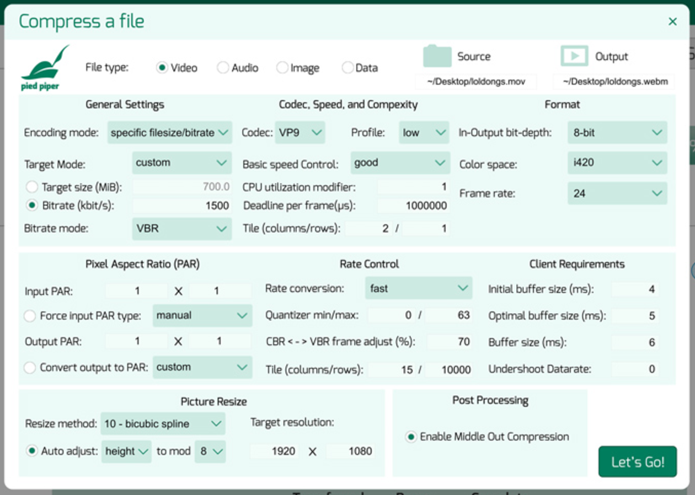
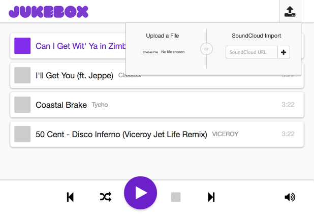
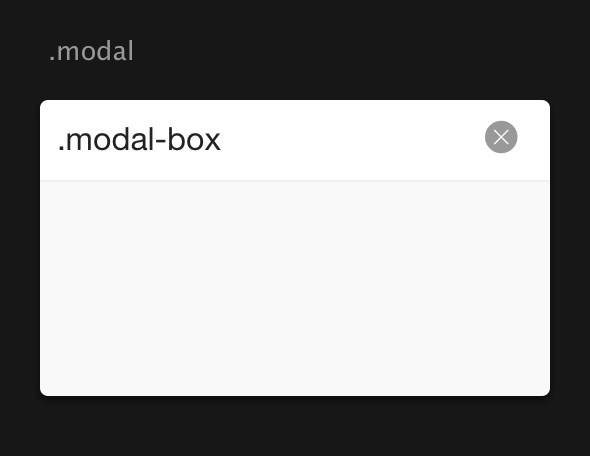

# [fit] Designing and Implementing<br/>Hidden & Layered Elements

---

# Dealing with Complex UIs

* So far, our applications have shown you everything you could interact with up front
* But some more advanced controls and interactions don't need to be shown right away
* This allows us to guide the user on a more controlled path and establish hierarchy, rather than overwhelming them with too many options up front

---

## You don't want your app to look like this:



---

## But would rather it look like this:


---

### Jukebox Example: Hidden Input


---

### Jukebox Example: Hidden Input (Hover)


---

### Jukebox Example: Hidden Input (Expanded)


---

### Jukebox Example: Hidden Input (Code)

```html
<div class="scimport">
	<button class="scimport-btn">SoundCloud</button>

	<form class="scimport-form">
		<input class="scimport-form-url" placeholder="SoundCloud URL"/>
		<button class="scimport-form-submit"/>
	</form>
</div>
```

```css
.scimport-form {
	display: none;
}

.scimport.showForm .scimport-form {
	display: block;
}

.scimport.showForm .scimport-btn {
	display: none;
}
```

---

# Using Depth

* The inline approach works well for simple inputs like a single text input, as seen previously
* But sometimes we need more space than is available (Smaller screens, more complex forms)
* For this, we might want to place an element _on top_ of other elements, so that we can have more space

---

# Using Depth (cont.)

* Despite the fact that websites appear flat, each element has a level of depth
* By default, this is determined based on how deeply nested an element is, and its position in html
* However, we can override that by using fixed / absolute positioning, and the CSS rule `z-index`

---

### What you think a page looks like


---

### What a page _actually_ looks like


---

### Jukebox Example: Popover


---

### Jukebox Example: Popover (Opened)



---

### Jukebox Example: Popover (Code)

```html
<div class="import">
	<input type="file" class="import-file"/>

	<form class="import-sc">
		<input class="import-sc-url" placeholder="SoundCloud URL"/>
		<button class="import-sc-submit"/>
	</form>
</div>
```

```css
.import {
	position: absolute;
	display: none;
	/* Size, position, color styles too. */
}

.import.isOpen {
	display: block;
}
```

---

# Focusing & Overlays

* Now that we're able to placing elements on top of each other, why not focus the user more
* We can cover the screen to make sure they're focusing only on the current task at hand
* By making it see-through, we can assure them that the screen isn't gone, just covered

---

### Jukebox Example: Modal


---

### Jukebox Example: Modal (Opened)


---

### Jukebox Example: Modal (Code)

```css
.modal {
	display: none;
	/* Fixed, so it covers the viewport */
	position: fixed;
	top: 0;
	left: 0;
	width: 100%;
	height: 100%;
	/* Translucent black background */
	background: rgba(0, 0, 0, 0.7);
}

.modal-box {
	position: absolute;
	/* Center it in the screen */
	top: 50%;
	left: 50%;
	transform: translate(-50%, -50%);
}

.modal.isOpen {
	display: block;
}
```



---

# Resources

* [Guidelines When Using Overlays / Modals](http://www.uxforthemasses.com/overlays/)
* [Z-Index: A Comprehensive Look](https://www.smashingmagazine.com/2009/09/the-z-index-css-property-a-comprehensive-look/)
