autoscale: true
slidenumbers: true
build-lists: true

<!-- Slide 1: Introduction to Node.js -->

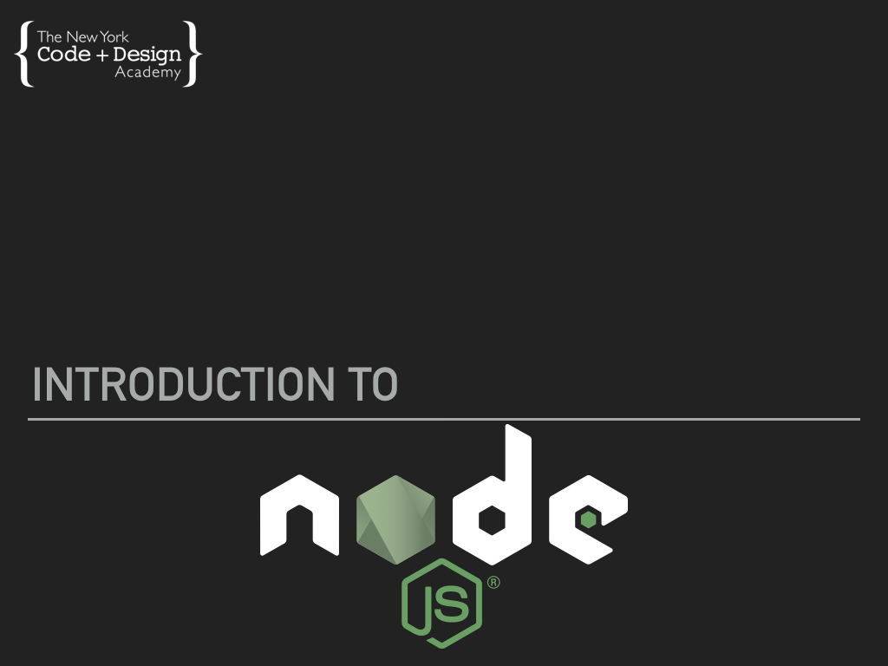

---
<!-- Slide 2: Agenda -->

# Agenda

- Quick Intro
- Node.js: The Beginning
- What Is Node.js?
- Why Use Node.js?
- Installing Node.js

---

<!-- Slide 9: What is Node.js? -->

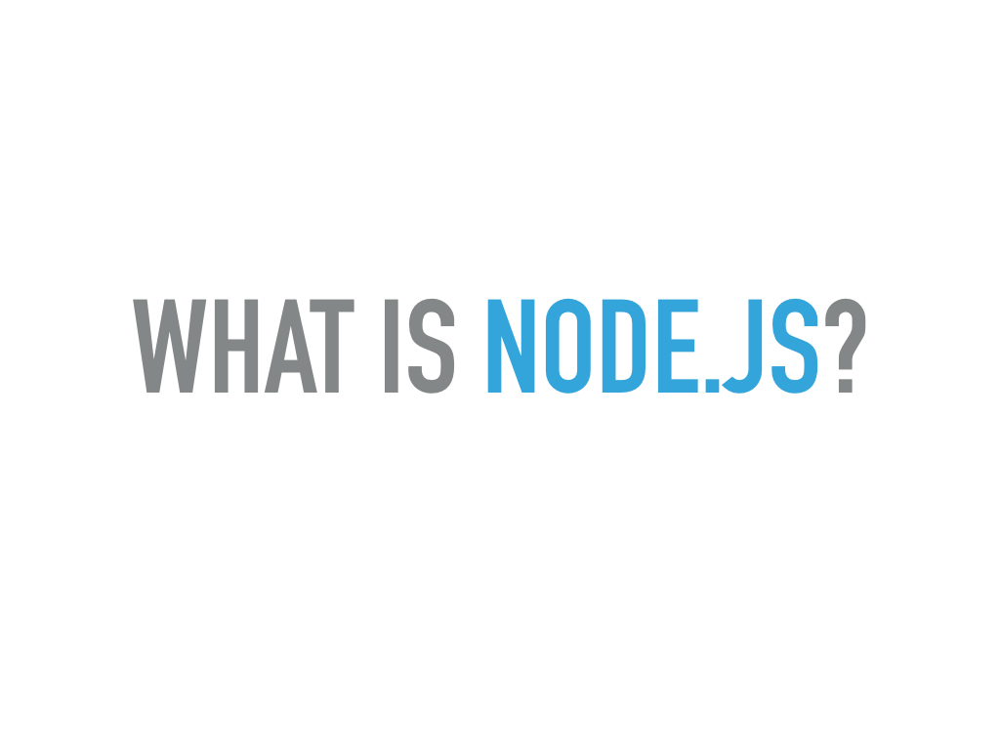

---

<!-- Slide 10: Node Homepage -->

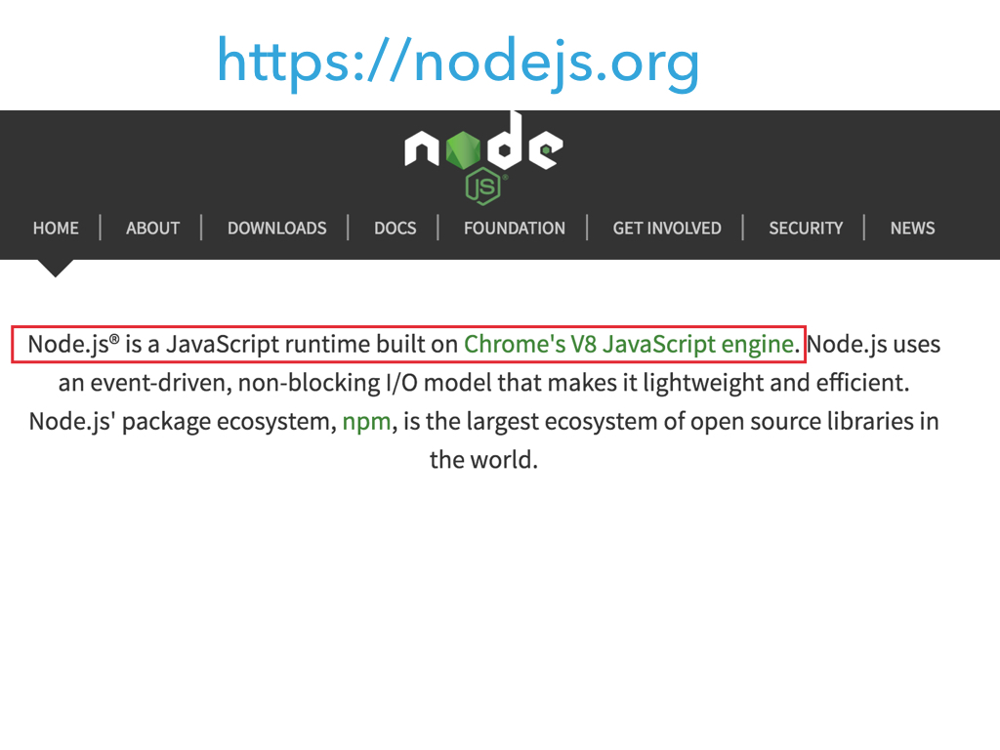

---
<!-- Slide 3: Quick Intro -->

## **No, but really, what is Node?**

- It's a javascript runtime for outside of the browser, either on your computer or on a server, using Chrome's V8 javascript engine.
- It allows us to share work between our frontend and backend code, since it's all javascript!
- It also provides us better tools for writing the kinds of scripts we've been writing so far.
- It's very performant, due to javascript's asynchronous nature.

---

## **What is a JavaScript Engine?**

- A program that interprets JavaScript code into native machine code.
- Sometimes referred to as an interpreter.
- Example engines include:
  - V8 (Google, Opera, Node)
  - SpiderMonkey (Mozilla)
  - JavaScriptCore (Apple)
  - Chakra (Microsoft)

---

## **What is a JavaScript Runtime?**

- A library used by the JavaScript Engine to implement functions during runtime aka execution of a program.
- These libraries often include functions for communicating with the user's computer in a cross-platform way, like:
  - File reading and writing
  - User input (window and document events)
  - Memory management (Making new variables, removing old ones)
- Example runtimes include:
  - Node.js
  - Browsers

---

# Google Chrome

 

- Uses a **client-side** JS Runtime
- Built in to the browser directly
- Handles tasks, such as:
  - Reading inputs from the user
  - Communicating things the user did to a server

---
<!-- Slide 14: Runtime Comparison -->

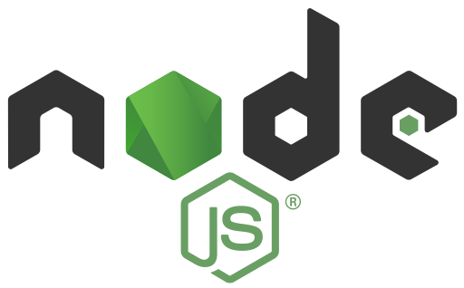

# Node.js

- Is a **server-side** JS Runtime
- Is installed on a computer or server
- Handles tasks, such as:
  - HTTP requests
  - File I/O Requests
  - Database queries

---
<!-- Slide 15: Node Homepage: Second Sentence -->

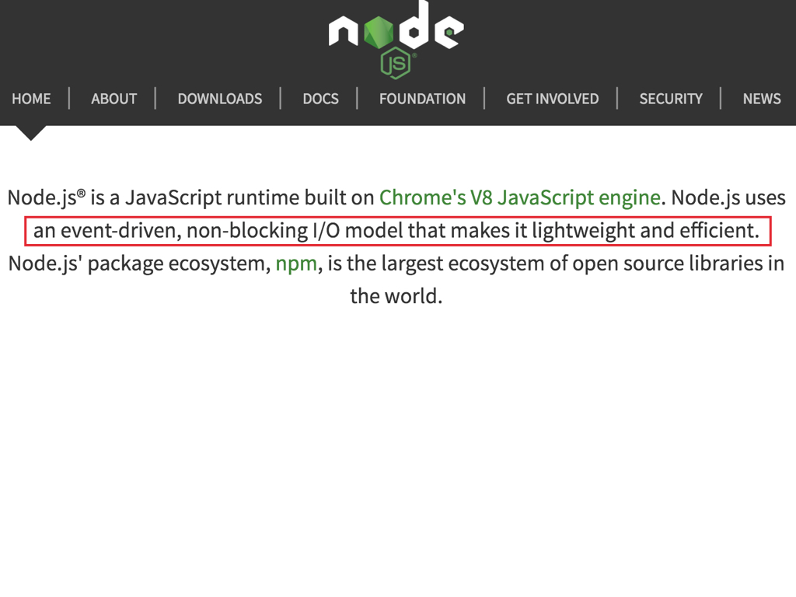

^ Ok, let's take a look at the second sentence on the Node homepage.

^ Node.js uses an event driven, non-blocking I/O model that makes it lightweight and efficient.

---
<!-- Slide 16: Client-Side Events -->

# Node is **Event-Driven**

Remember the JavaScript Event-Handling lecture?

- When this **event** happens, do this **action**.
  - _Example:_ When a user `clicks` this button, `display` this menu.
    - This is considered a _Client-Side_ event.

---
<!-- Slide 17: Server-Side Events -->

# Node is **Event-Driven**

- Some common server-side events, include;
  - `connect`
  - `abort`
  - `open`
  - `close`
- _Example:_ When this file is `open`, `append` the date.

---
<!-- Slide 18: Listening for Events -->

# Node is **Event-Driven**

- Node is always **listening** for new `events`
- When Node recognizes an `event`, it sends the relating action off to process, then creates a `callback`.
  - A **`callback`** is just that, Node calls back that action, so it can answer another event.
  - _Example:_ When this file is `open`, `append` the date...**brb**...Ok, now `close` the file.

---
<!-- Slide 21: Node is Non-Blocking -->

# Node is **Non-Blocking**

- Non-Blocking operations are sometimes referred to as **Asynchronous** operations
- Other code will execute while Node waits for the asynchronous operation to complete

---
<!-- Slide 22: Blocking Operations -->

# vs **Blocking**

- Blocking operations are sometimes referred to as **Synchronous** operations
- No other code can execute until the synchronous operation completes
- If the operation is slow, this can be an issue

---
<!-- Slide 8: Blocking File Upload -->

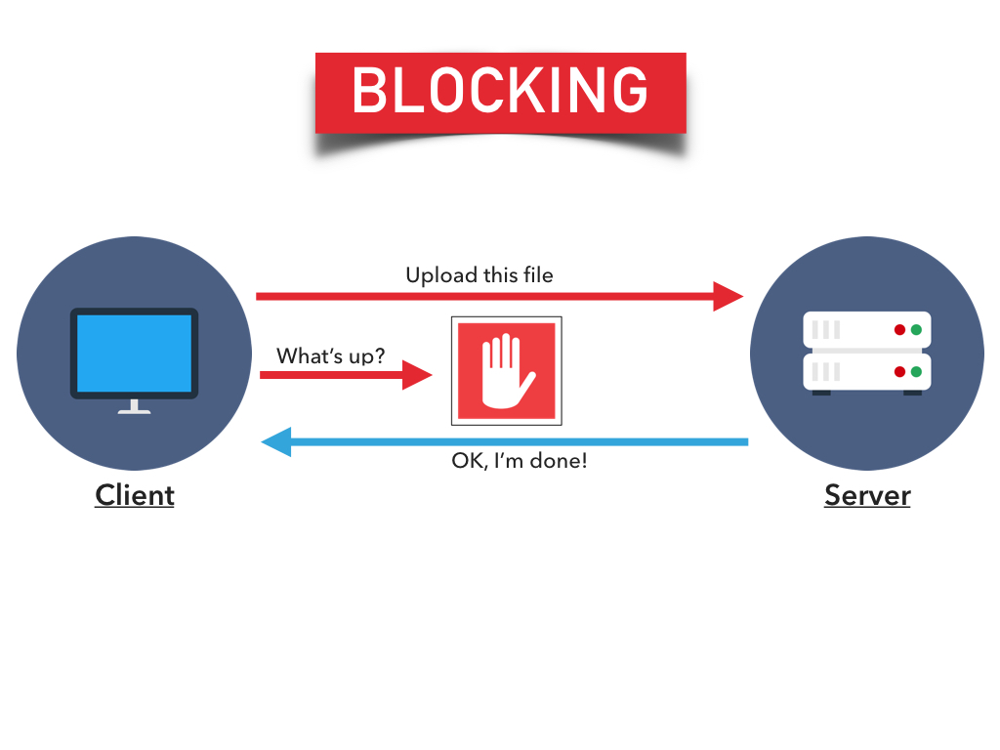

---
<!-- Slide 7: Non-Blocking File Upload -->

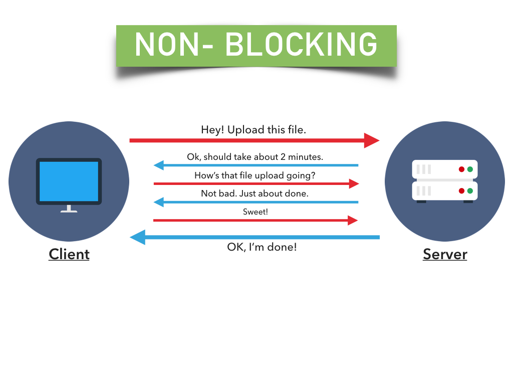

---
<!-- Slide 23: Synchronous Code Example -->

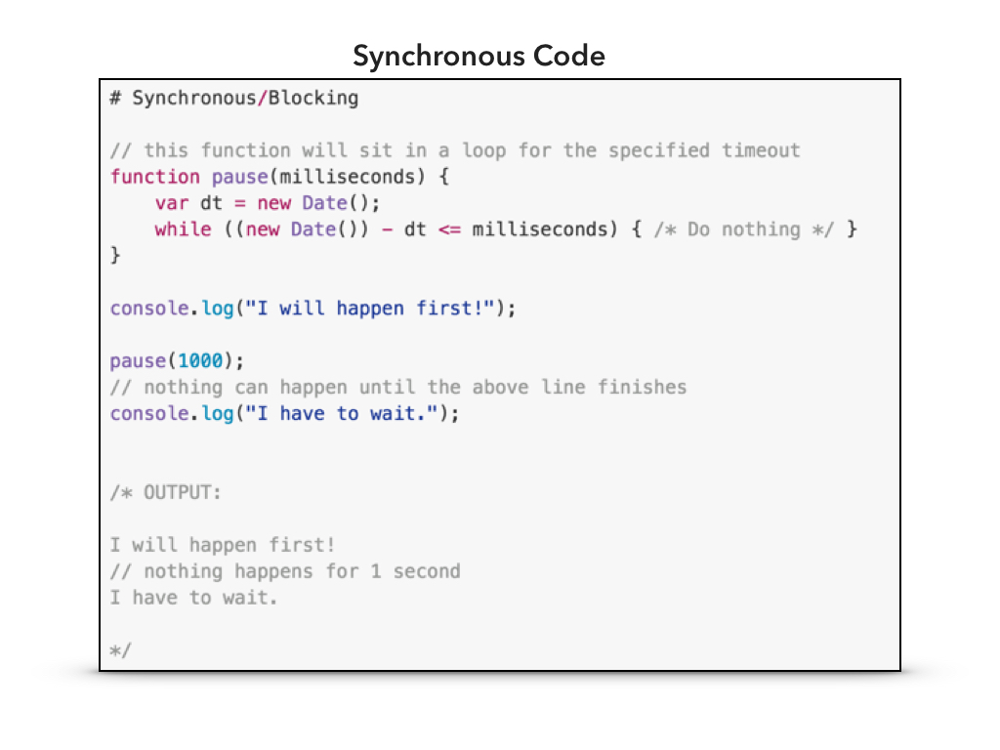

^ Here's an example of Synchronous or Blocking code.

---
<!-- Slide 24: Node Is Single-Threaded -->
# Node is Single-Threaded

- A thread is a single computer process
- Node's main Event Loop runs in a single thread
- Events and Callbacks are queued in the order they are received

---
<!-- Slide 25: Event Loop Example-->
# Event Loop Example

- A web request is received
- Node executes the handler for that request
- The handler initiates a database query, with a callback
- Node is free and able to handle other requests
- The database query ends, and Node is notified (event)
- Node adds the callback to the queue
- Node executes the handler after processing any events before it in the queue

---
<!-- Slide 26: Why Use Node -->

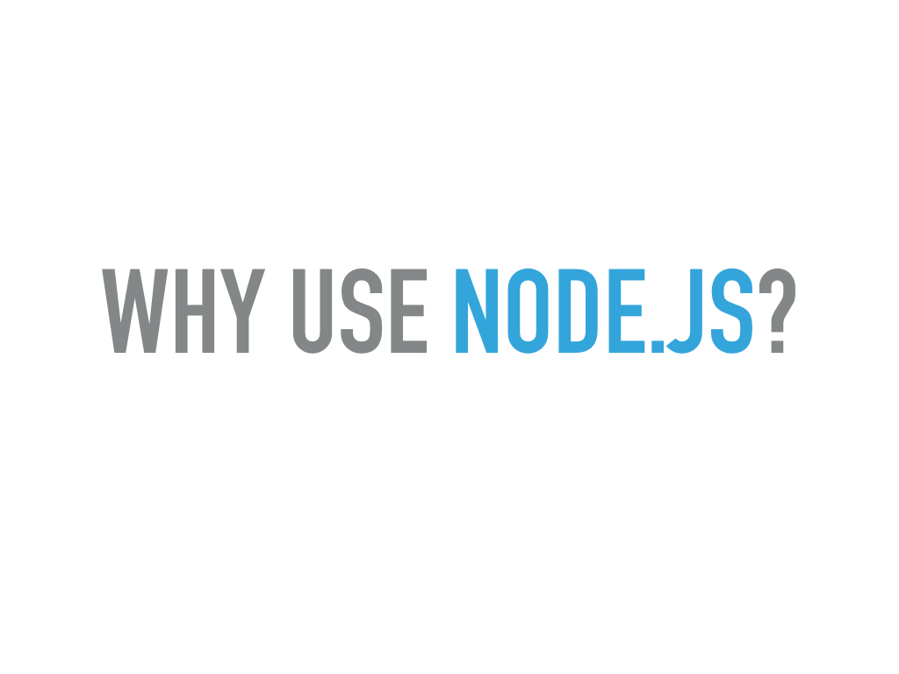

---

# What does it offer?

* Node allows us to take the tools we learn for building interfaces, and apply it to all sorts of other problems.
* With a common language between our frontend and backend code, we can reuse more and be more diverse as developers.
* There is a huge community of other JS developers, and a ton of open source software to use.

---
<!-- Slide 29: Node can ALSO Create -->

# Write for more than the web

- Node also empowers us to use javascript to make:
  - desktop, android, iOS applications
  - handy automated scripts
  - video games
  - persistent data servers

---
<!-- Slide 30: Installing Node -->

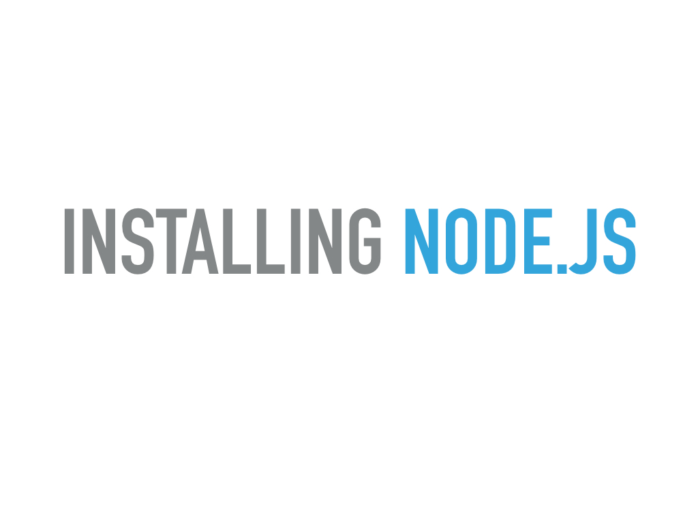

---
<!-- Slide 31: Installation Steps -->

# **Installation Steps**

1. Go to [https://nodejs.org](https://nodejs.org)
2. Click the **LTS** download button
3. Open Installer
4. Follow prompts to complete the installation

---
<!-- Slide 32: Basic Node Terminal Commands -->

## Basic Node Terminal Commands

- **`node`**
	- opens an interactive shell where you can execute JavaScript code
- **`node file_name.js`**
	- executes JavaScript code that is in a file
- **`node -v`**
	- displays the version of Node installed on your computer

---
<!-- Slide 33: Exercise #1: Hello Node! in the Terminal -->

## **Exercise #1:** Hello Node!

- Using the Node interactive shell, output **`Hello Node!`** in the terminal
- Save a **`Hello Node!`** script in a file and execute that file in the Terminal

---

## Challenge: Descending String Interval

Using our newfound Node knowledge, try to tackle [this assignment](https://canvas.instructure.com/courses/1131902/assignments/5940054).

- _Hint 1: Printing out stuff to the terminal is just the same as in a browser._
- _Hint 2: You will probably want to use setTimeout for the delays!_
- _Hint 3: Did you know a function can call itself? Whoa! Might be useful..._

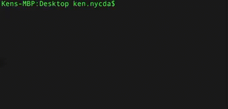
