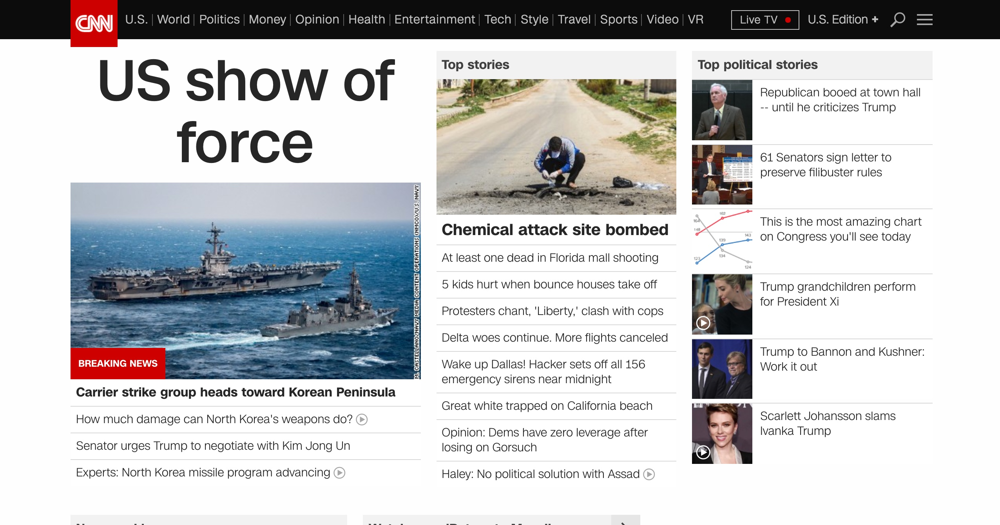
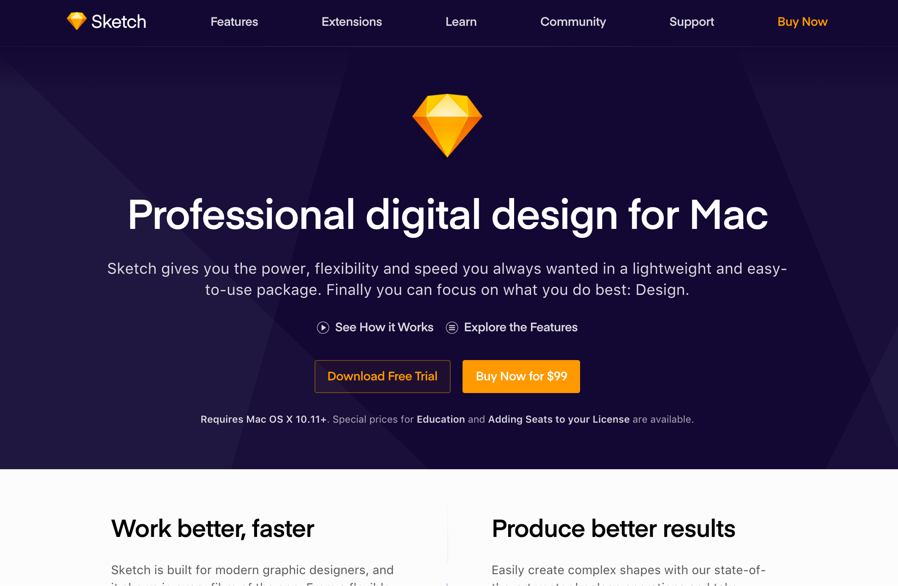
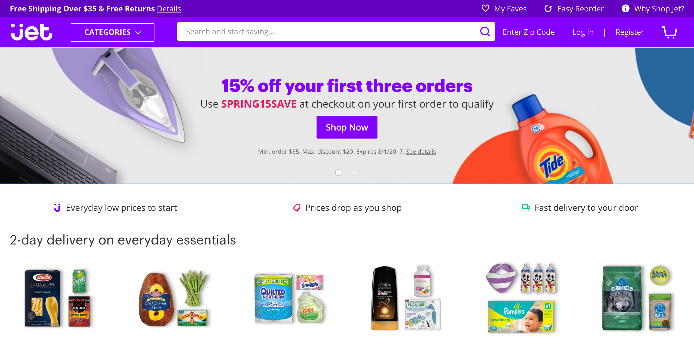
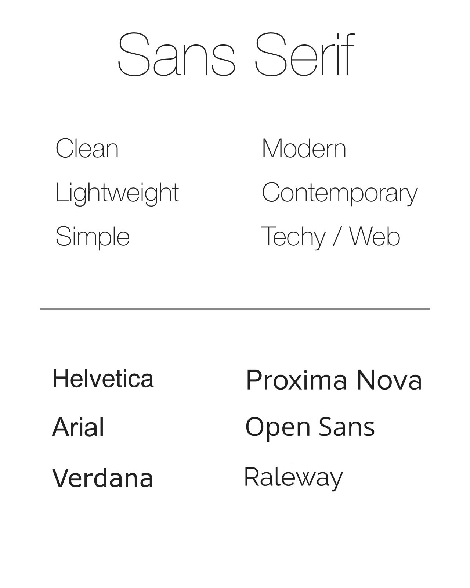
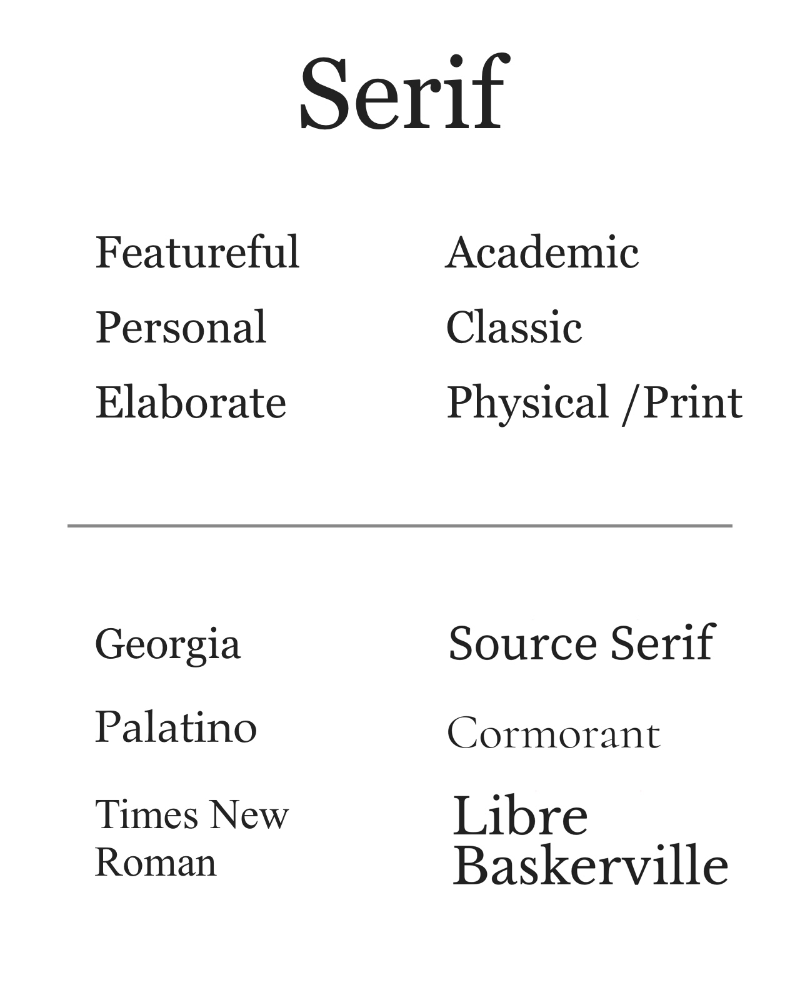

# [fit] Design Basics

---

# Why do I need to know design?

* Web developers who have an eye for design are more desirable than those who don't
* While you'll often work with designers, sometimes you'll need to wing it for minor things or admin pages
* If you feel good enough, you can be a one-person web shop offering people full site builds without needing a designer

---

# Color & Palettes

* When choosing colors, we want to select from a fixed set, not continually introduce unique colors everywhere
* Creating a palette centered around one or two primary colors with various shades reduces visual "noise"
* Use your colors sparingly to highlight particular things you want your users to focus on
* Still room for secondary colors in special conditions

---

---

---

---

# Color & Palettes (Resources)

* [Web Developer's Guide to Color](https://www.smashingmagazine.com/2016/04/web-developer-guide-color/) - Overall good guide to deciding your colors
* [ColourLovers](http://www.colourlovers.com/palettes) - Tons of palettes for use / inspiration
* [Palettable](http://www.palettable.io/) - Pick your palette by playing a game!

---

# Typography

* Much like colors, we want to limit our type options to better communicate things to users
* 1-2 fonts at most, _maybe a third_ if you're only using it for something _very_ specific
* Limit your sizes as well, 4-6 sizes is usually more than enough
* High contrast colors for easiest reading

---

---

---

# Typography (Resources)

* [Google Fonts](https://fonts.google.com/) - Tons of fonts, good filters
* [Font Squirrel](https://www.fontsquirrel.com/) - Plenty of off-beat fonts not found elsewhere
* [Type Scale](http://type-scale.com/) - Recommend font sizes using the golden ratio

---

# Style guides

Many companies publish their internal style guides to show how designers adhere to their brand. A ton of these are available, but I few I really like are:

* [Medium](https://www.behance.net/gallery/7226653/Medium-Brand-Development)
* [Spotify](https://issuu.com/bondo/docs/spo_brandidentityguidelines_final)
* [Google's Material Design](https://material.io/guidelines/)

---

**Additional reading**

[Visual Mess](http://www.visualmess.com/) - A guide on cleaning up visually messy designs. I looked at a few tutorials, but honestly I think this does the best job of showing rather than telling you design techniques.

 

**Design Communities**

* [Dribbble](https://dribbble.com/) - Github, for designers
* [r/web_design](https://www.reddit.com/r/web_design/) - Subreddit for web designers
* [Designer News](https://www.designernews.co/) - News and trends discussions
