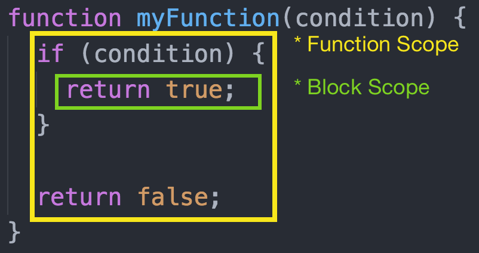

# `var` vs<br/> `let` vs<br/> `const`

---

# The current state of things

* Up to this point we've been using `var` to declare new variables that we can later re-assign to
* This has worked fine for the most part, but there are some issues with `var`
* However, these issues can't just be fixed, since old code may rely on them
* Thus, new keywords were created that handle those issues

---

# Problem #1: Scoping

Take this code sample, what would you expect to happen?

```js
for (var i = 0; i < 5; i++) {
	var text = "The loop count is " + i + 1;
}

// text should be undefined... or should it?
console.log(text);
```

---

# Problem #1: Scoping (cont.)

The issue is that `var` declares things at the _function_ level, not the _block_ level. Anything declared inside of a function (or globally, if not in a function) are available. That also means it can be **overridden** anywhere in the function.



---

# Problem #2: Redeclaring

If we're not keeping track of our code, we might accidentally re-declare a variable within the same scope. This is almost always indicative of a mistake, but `var` will let that happen.

```js
var text = "hello";

// ... later that file

var text = "goodbye";
```

---

# Introducing `let` and `const`

* Using either `let` or `const` will limit you to the current _block_ level scoping, and any lower scopes.
* They also cannot be redeclared _within the same scope_. This will result in an error.
* `let` variables can be reassigned, just like var
* `const` variables **cannot** be reassigned, they must keep their initial value

---

## Example 1: For loop

```js
// This will mistakenly print "4" "4" "4" "4" "4"
for (var i = 0; i < 5; i++) {
	setTimeout(function() {
		console.log(i);
	}, i * 1000);
}

// This will correctly print "0" "1" "2" "3" "4"
for (let i = 0; i < 5; i++) {
	setTimeout(function() {
		console.log(i);
	}, i * 1000);
}
```

---

## Example 2: Declaring in conditionals

```js
if (condition) {
	var something = true;
}

if (something) {
	console.log("condition was true!");
}

/* ↑ var ********* let ↓ */

let something;
if (condition) {
	something = true;
}

if (something) {
	console.log("condition was true!");
}
```

---

## Example 3: Reassigning `const`

```js
const text = "hello";
text = "goodbye";
// This will result in an error!

const obj = { attr: true };
obj.attr = false;
// This is fine, since it's still the same object
```

---

# Why use `const` at all?

* Some people question the value of it. After all, they function the same whether or not I re-assign, right?
* As good developers, it's our job to try and make our code as clear as possible.
* Letting other developers know this variable is expected to stay the same is a valuable communication tool.
* Therefore, we should take advantage of that and use `const`.

---

# Caveats

* Our new friends `let` and `const` don't have 100% browser support yet, which is why we started with `var`
* However, since node doesn't run in browsers, we don't have to worry about that
* Therefore, **all futher node code should be written using `let` and `const`** as they have the more 'correct' behavior
* We'll handle this compatibility problem on the web soon, but get used to the differences for now
