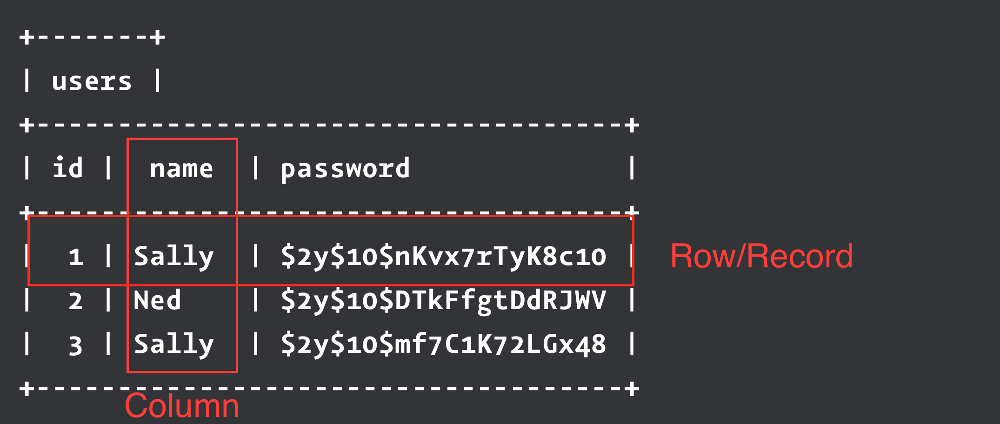

autoscale: true

# Databases #1: Introduction

---

# Why learn about databases?

- A website without data is just a static collection of text
- We've made a few dynamic apps using APIs and files, but these usually can't store our own data as well
- Databases efficiently store and retrieve information, in a very performant way

---

# What is a database?

- A database is like a programatic Excel spreadsheet: **Rows** and **columns** of data
- These rows and columns live in individual named **tables** with **schemas** for how the data looks
- Data can be inserted, read, updated, and destroyed (_Just like HTTP methods_)

---

# Tables

- Every table has a name that represents what it keeps data for
- Each table should only hold one type of thing, e.g. "users", "orders", "employees"
- A "users" table might store user information like userid, username, email, password etc
- A "products" table might store information like name, price, description etc

---

# Tables (Example)



---

# Tables (`id`)

```
+-------+
| users |
+------------------------------------+
| id |  name  | password             |
+------------------------------------+
|  1 | Sally  | $2y$10$nKvx7rTyK8c10 |
|  2 | Ned    | $2y$10$DTkFfgtDdRJWV |
|  3 | Sally  | $2y$10$mf7C1K72LGx48 |
+------------------------------------+
```

^ Let's take a look at each of the columns

- The `id` column is the unique identifier for the particular row it belongs to
- It is referred to as a **PRIMARY KEY**, the main reference for a row
- Almost every table will include an `id` column for storing unique IDs
- The unique ID is an Auto Incrementing ID (automatically assigned on creation)

---

# Tables (`name`)

```
+-------+
| users |
+------------------------------------+
| id |  name  | password             |
+------------------------------------+
|  1 | Sally  | $2y$10$nKvx7rTyK8c10 |
|  2 | Ned    | $2y$10$DTkFfgtDdRJWV |
|  3 | Sally  | $2y$10$mf7C1K72LGx48 |
+------------------------------------+
```

- The `name` here is just a simple string, like in Javascript
- Only the `id` column needs to be unique, most other columns can contain duplicates
- However, we could flag name as unique if we wanted, say, unique username

---

# Tables (`password`)

```
+-------+
| users |
+------------------------------------+
| id |  name  | password             |
+------------------------------------+
|  1 | Sally  | $2y$10$nKvx7rTyK8c10 |
|  2 | Ned    | $2y$10$DTkFfgtDdRJWV |
|  3 | Sally  | $2y$10$mf7C1K72LGx48 |
+------------------------------------+
```

- The `password` is also a string value, like `name`
- But don't be fooled, they don't have strong passwords, these are **hashed**
- We rarely want to directly store sensitive data like passwords
- Instead we insert values that can be used to verify that user input is correct

^ You don't store actual passwords in a DB. You store encrypted versions of them.
^ We won't talk about this any further today.
^ You will be hashing your passwords with a framework of choice. This is not important right now.

---

# Schemas

- Every database has a set of **schemas** that define its tables and what data they hold
- These are kind of like classes, a blueprint for what data represents its row entities
- The structure includes **tables** and their **columns**
- Every column has a **data type**

---

# Data Types

* When defining a table, you must specify a data type for every column in it
* Data types are similar to Javascript, but not completely 1:1
* There are many data types that we won't cover, since they're very specific
* But the most common data types are:
  - **VARCHAR**: Variable-length string of characters
  - **INTEGER**: Numbers with no decimal (5)
  - **DECIMAL**: Numbers with decimal (50.10)
  - **BOOLEAN**: Stores TRUE/FALSE values (1 or 0)
  - **DATETIME** / **TIMESTAMP**: Stores a date and time value

---

# Database Management Systems

- MySQL, SQLite, PostgreSQL, Microsoft SQL Server are all popular DBMS's
- The different DBMS's are not very important right now, as they share most things
- Just know that that while some minor points may vary, the concepts are all the same
- We will be using PostgreSQL in our class

---

# SQL - The Language of Databases

- We interact with databases using SQL, Structured Query Language
- This is a very simple programming language that varies slightly from one DB to another, but is mostly the same in databases
- You will see some examples in upcoming slides, don't worry about understanding them completely
- Just know that it shares some things with Javascript, such as parentheses for grouping, quotes for strings, and semicolons to end statements

---

# Basic SQL Table

```sql
CREATE TABLE people (
  username VARCHAR(255) UNIQUE,
  first_name VARCHAR(255),
  last_name VARCHAR(255),
  age INT,
  birthday TIMESTAMP
);
```

- Between the parenthesis the first value is the **column name**, the second value is the **data type**
- Data types sometimes take in an argument to further configure it
- `username`, `first_name`, and `last_name` are all VARCHARs (strings)
- `age` is an INT, a whole number (no decimals)
- `birthday` is a TIMESTAMP

^ Explain syntax line by line
^ No comma on the last column definition
^ Semi colon closes statement
^ Between the parenthesis is the SCHEMA

---

# Basic SQL Table (cont.)

```sql
CREATE TABLE people (
  username VARCHAR(255) UNIQUE,
  first_name VARCHAR(255),
  last_name VARCHAR(255),
  age INT,
  birthday TIMESTAMP
);
```

- UNIQUE is a **constraint** indicates that every entry in username must not already be there
- VARCHARs require us to specify their maximum length
- INTs and TIMESTAMPs don't require any configuration (by default)
- 255 is 2^8, lengths should typically be powers of 2
- This bit of SQL represents the **schema** for the people table

^ Explain syntax line by line
^ No comma on the last column definition
^ Semi colon closes statement
^ Between the parenthesis is the SCHEMA

---

# Constraints

* **PRIMARY KEY**  - Values must be unique for each row in a table and not be NULL, max 1 per table
* **UNIQUE**       - Values must be unique (or null) for each row in a table
* **NOT NULL**     - Values for the column must not be NULL
* **DEFAULT**      - Provide a default value for the column if no value is provided
* **REFERENCES**   - Value is a reference to a PRIMARY KEY in another table

All of these can be provided after the type argument in the schema. You can have multiple constraints on a single column.

---

# SQL Table With Constraints

```sql
CREATE TABLE people (
  username VARCHAR(255) NOT NULL UNIQUE,
  first_name VARCHAR(255),
  last_name VARCHAR(255) NOT NULL,
  age INT DEFAULT 21
);
```

- No 2 rows can have the same `username`
- `username` and `last_name` must exist on every row, never NULL
- If no `age` is provided, the row will be created with the value `21` for age

---

# Why Use Constraints?

- Correct data is very important to a stable program
- Constraints on the DB level enforce good data
- Make your DB as strict as possible
- If your application expects a value to be unique, you must remember to create that constraint
- If a value should never be empty, you must enforce the NOT NULL constraint

---

# References

- [PSQL Docs: Data Types](https://www.postgresql.org/docs/9.5/static/datatype.html)
- [PSQL Docs: Constraints](https://www.postgresql.org/docs/9.4/static/ddl-constraints.html)
