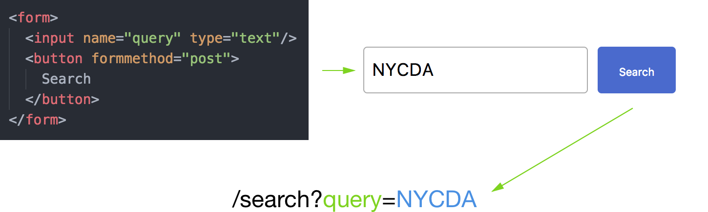

autoscale: true

# Form Submission & POST Requests

---

## What We Know So Far

* We can pass data to Express by using the URL as arguments
* The POST and PUT http method types are meant for creating and altering entities, respectively
* Using these arguments, we could put them in to SQL queries or other functions
* So how do we put all of this together?

---

## Bringing Back the `<form>` Element

* You should remember the `<input>` and `<form>` elements from previous lessons
* These handle user input and submission to the server, respectively
* The reason that a form, by default, refreshes the page when you hit enter / click a button is making a GET request with the input's data
* GET request parameters are sent either in the path, or in the query

---

## A `<form>` Example (html)



---

## A `<form>` Example (node)

* We then have access to those query parameters in Express, for use as variables (i.e. in this login function)

```js
// Render the login form
app.get("/search", function(req, res) {
	let results = [];

	// If they submitted the search, get results for rendering
	if (req.query.query) {
		results = getSearchResults(req.query.query);
	}

	res.render("search", {
		result: results,
	});
});
```

_The `getSearchResults` function here is a made up example, don't worry about what it does._

---

## Form Configuration via Attributes

* The form by default submits all of its inputs in a GET request as ?name=value to the current path
* We can change which path it submits to using the `action="/some/path"` attribute
* We can change the GET to a POST using the `method="post"` attribute (No PUT or DELETE)
*

```html
<form action="/login" method="post">
	<input name="username" type="text"/>
	<input name="password" type="password"/>
	<button formmethod="post">
		Submit
	</button>
</form>
```

---

## Handling POST Requests

* Now that we can change the method from GET to POST, we should be using that when we want to create a new entity, rather than add some arguments to a GET
* However, POST requests send their data using the **body**, not the query parameters
* This is so that it can send complex data types that aren't limited by fitting in a URL
* This also keeps sensitive information (like a password) out of the URL, and hidden away
* But in order to handle body requests, we need to configure Express to use them
* Afterwards, they'll be available in `req.body`, just like `query` and `param`.

---

## Handling POST Requests (code)

```bash
# Install the body-parser module
npm install --save body-parser
```

```js
const express = require("express");
const bodyParser = require("body-parser");
const app = express();

// Configure your app to correctly interpret POST
// request bodies. The urlencoded one handles HTML
// <form> POSTs. The json one handles jQuery POSTs.
app.use(bodyParser.urlencoded());
app.use(bodyParser.json());

// Login endpoint expects username and
// password in the request's body
app.post("/login", function(req, res) {
	if (login(req.body.username, req.body.password)) {
		res.redirect("/home");
	} else {
		res.status(403).render("/login", {
			error: "Incorrect username or password",
		});
	}
});
```

---

## Form Configuration via Buttons

* The `<button>` element can also add arguments using the `name` and `value` attributes, just like inputs
* You can also override the form's action and method with `formaction` and `formmethod`
* That way, one form can have two different actions based on which button is pressed

```html
<!-- edit-blog.ejs -->
<form action="/blog/<%- post.id %>" action="post">
	<input name="title" type="text" value="<%- post.title %>"/>
	<textarea name="content" value="<%- post.content %>"/>

	<button name="save" value="1">Save</button>
	<button name="delete" value="1">Delete</button>
</form>
```
```js
// app.js
app.post("/blog/:id", function(req, res) {
	if (req.body.delete) {
		deleteBlogPost(req.params.id);
	}
	else {
		saveBlogPost(req.params.id, req.body.title, req.body.content);
	}
});
```

---

## Succesful Redirects

* Often times when a form submit goes well, we want to take the user somewhere else
* Express will allow you to do this using `res.redirect("/new/path")`
* You can also add some query parameters if you want to indicate what happened

```js
app.post("/save", function() {
	res.redirect("/home?saved=1");
});

app.get("/home", function(req, res) {
	let notice = "";

	if (req.query.saved) {
		notice = "Save succesful!"
	}

	res.render("home", {
		// Rendered somewhere in the template
		notice: notice,
	});
});
```

---

## Unsuccesful Submits

* On the flip side, sometimes things go wrong in a form submission
* Maybe a user forgot a field, put too much text, or tried to put letters in a number field
* In this case, we usually want to re-render the form, but with an error message displayed

```js
app.post("/conversation", function(req, res) {
	if (req.body.message) {
		// Redirect them back to app.get("/conversation")
		res.redirect("/conversation?sent=1");
	}
	else {
		// Re-render the conversation with an error message
		res.render("conversation", {
			error: "Message is required",
		});
	}
});
```

---

## Exercise: Make a Bulletin Board Form

* Using the Bulletin Board database and code we wrote from the previous class, let's make a form to submit to it
* Create a new template for the form page, and add the necessary elements to it
* Make a `post` Express route that can handle the form submission
* Send the parameters from the POST request to the function for making a new bulletin board post
* If the post is saved succesfully, redirect them back to the list page with a saved message
* If the post had errors (title too long, missing text) re-render the form with an error message

---

# Additional Reading

* [MDN's <form> element docs](https://developer.mozilla.org/en-US/docs/Web/HTML/Element/form)
* [MDN's <button> element docs](https://developer.mozilla.org/en-US/docs/Web/HTML/Element/button)
