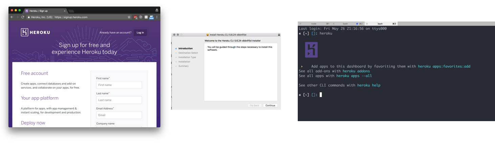

autoscale: true

# Heroku: Getting Started

---

# Where We Are Now

* So far, all of our projects have been running on our local machine
* This is usually the starting point when developing a project from the start
* However, at some point we'll want our Express web servers to be accessible from the internet
* While we could run the server on our own computer, we'd have to open up ports, guarantee the server doesn't stop, point a domain at our IP address etc.
* Instead of all of that, we typically use a hosted solution like **Heroku**

---

# What is Heroku?

* Heroku is a hosting platform made for and by developers, founded in 2007
* It has become a pretty standard all-in-one solution for hosting database backed web servers
* They provide a computer for our code to run on, and the software to run Node and Postgres (Or many other programming languages, frameworks, databases etc.)
* They also give us many tools for implementing best practices in our code

---

## 1) First Time Setup

* You'll need to make a [new account](https://signup.heroku.com/dc) before anything else
* Then you'll need to [install the command line tools](https://devcenter.heroku.com/articles/heroku-cli), run `heroku` in the terminal to make sure it worked
* Once you're signed up and installed, run `heroku login` to connect your account



---

## 2) Make a New Project

* Heroku works with many programming langauges and frameworks, but we're going to focus on working with Node
* Create a fresh Node project that is a simple express server
  * Initialize git, initialize npm, install & save express
* Make an app.js file that makes a new express app, and add a new GET endpoint for the homepage that prints _anything_

---

## 3) Initialize Heroku

* The next thing we'll do is run `heroku create [project-name]`
	* All apps must have unique names, so don't expect "todo-list" or "jukebox" to work as a project name
	* You can also just run `heroku create` and have it randomly generate a name for you
* This will create a website and git repository on Heroku for your code to live and be accessed
  * This git repository is _not_ the same as Github. It's completely private, and only runs code you push to it, not Github.
* Go ahead and access the domain!

---

## 4) Deploying to Heroku

* You should have been greeted with a Heroku welcome page
* But we don't want that, we want _our_ app
* This is because we haven't pushed our code yet!
* You can do so by committing your code so far, and then running `git push heroku master`
  * Note that this isn't _origin_, which is our github, it's _heroku_
	* We're pushing the same `master` branch code to a different place
	* The `heroku` remote was added for us when we ran `heroku create`
* Open your site again! (Try running `heroku open`)

---

## 5) Heroku Logs


* I'm guessing your site, didn't work, even if it worked on your computer?
* Reading errors is different on a server since we don't have console output
* Fortunately, heroku lets you read output by running `heroku logs --tail`
  * `--tail` makes it keep updating, instead of printing once
* Can you figure out what went wrong?

---

## 6) Making Our Code Heroku Friendly

* All of the best practices we've learned recently weren't for nothing, they're meant for running code on a server like Heroku
* In order for our apps to run elsewhere, we need to do the following:
  * Add a `"start"` script to your package.json, this is what Heroku uses to run our app
	* Make sure you `--save` any dependencies, Heroku needs to install them
	* Use `process.env.PORT || 3000`, Heroku doesn't run its apps on port 3000
* These are just a few examples with this particular simple app, but whenever you're writing code, try to think "Will this be the same on Heroku?"

---

## Side Note: Procfile

* Heroku's pretty smart about Node, and knows that package.json scripts are where developers usually keep their commands
* However, Heroku also has a more open ended solution for running commands known as the Procfile
* This is a file (named `Procfile`) of `process: command` lines that allow you to specify commands to run for various Heroku processes
* For the website, we would add
```
web: node app.js
```
if we didn't have a package.json run script
* There are other process types besides `web`, but that's the only one we'll be using

---

## Side Note: Run Heroku Locally

* To better simulate the Heroku environment locally, we can run our app the same way Heroku does
* By running `heroku local [command]`, we do all the same things Heroku would do:
  * Run the command in the Procfile (No command will do `npm start`)
  * Load a `.env` file, if it exists
	* Load Heroku's configuration environment variables
	* Provide the same console output as Heroku
* Running `heroku local` instead of `npm start` directly can often help with better simulating what's happening on Heroku, which might help with debugging

---

# Additional Reading

* [Heroku's Getting Started With Node Guide](https://devcenter.heroku.com/articles/getting-started-with-nodejs#set-up) - Covers everything I've talked about today and more
* [Heroku's Example Node / Express App](https://github.com/heroku/node-js-getting-started) - Good reference for code that works in a Heroku environment
