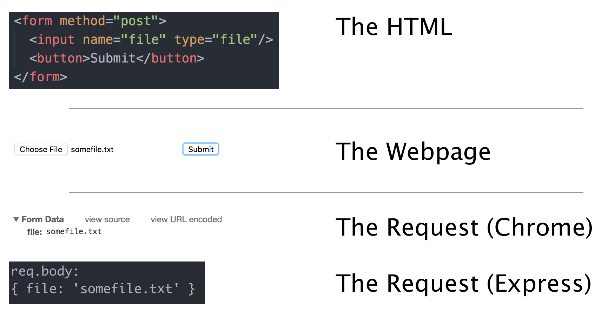
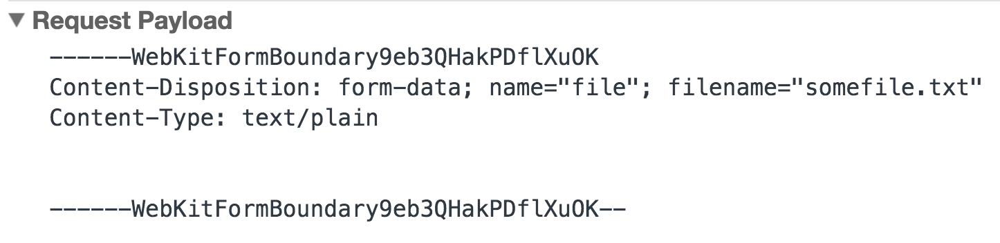
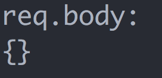

autoscale: true

# Dealing With File Upload Server-Side

---

# Files As We Know Them

* In our Jukeboxes, we used the `<input type="file">` element to add files from our machine to the webpage, but this stayed entirely on the client's javascript
* In Express, we've submitted data using `<form>` elements that submit the values from `<input>` elements
* So what would happen if we took a file input, put it in a POST form, and submitted that?

---

# Looking at the Request



---

## So Where's The File?

* All we sent in the POST request was the filename, and so all we had on the server was the file name
* This is no good to us, since our server can't access the file by name alone, since we don't have access to their computer
* We only get the file name because all the form sends in the POST by default is the `value` of each input
* If you recall from Jukebox, all the `value` is on a file input is the name of the file

---

## Form Encoding Types

* Forms have many different encoding types, that we can set by using the `enctype` attribute on a form
* The default type is `application/x-www-form-urlencoded` (Quite the mouthful)
* You may recall that in Express, we use `bodyParser.urlencoded()` to interpret form post requests, notice the similarity in name?
* But we can't URL encode the data of a file, there's just too much

---

## Encoding Type `multipart/form-data`

When we want to file inputs, or other very large inputs, we set the `enctype` attribute to `multipart/form-data`

```html
<form enctype="multipart/form-data">
```

<br/>

> The content type "application/x-www-form-urlencoded" is inefficient for sending large quantities of binary data or text containing non-ASCII characters. The content type "multipart/form-data" should be used for submitting forms that contain files, non-ASCII data, and binary data.

    - W3 Spec

---

### Looking at the Request (`multipart/form-data`)



<br/>

Even though we don't see the file content in Chrome's preview of the request, it is in fact being sent along with all of the metadata about the file

---

## Reading It From Express



* Even though it sent the data, Express won't be able to read it
* This is because we only configured our server to read `urlencoded` form POSTs, not `multipart` ones
* But unfortunately, our handy `body-parser` middleware module doesn't have anything like a `multipart()` function to handle this, because multipart forms are much more complex
* Where would the file go? How would we read it in node?

---

## Introducing the `multer` Module

```bash
npm install --save multer
```

* Because of the complex behavior of file uploading, there's a whole module dedicated to this called `multer`
* Multer provides us with a configurable middleware to determine where files from multipart requests should go
* It also interprets the other basic inputs in the request, in the same way as `body-parser`

---

## Using the `multer` Middleware

```js
const multer = require("multer");
const uploader = multer({ dest: "uploads/" });

app.post("/form", uploader.single("file"), function(req, res) {
  console.log("Uploaded a file that is " + req.file.size + " big");
  res.send("Upload complete!");
});
```

---

## Breaking Down the Code (pt. 1)

```js
const multer = require("multer");
const uploader = multer({ dest: "uploads/" });
```

* We require the `multer` module, which is _not itself middleware_, but a function that generates an uploader for us to create middleware with
* We specify where we want our files to be saved with the `dest` argument, relative to the root of our project
* This folder is created for us, though _we should add it to `.gitignore`_ since we don't want to commit user uploaded files to git

---

## Breaking Down the Code (pt. 2)

```js
app.post("/form", uploader.single("file"), function(req, res) {
  console.log("Uploaded a file that is " + req.file.size + " big");
  res.send("Upload complete!");
});
```

* `uploader` is a singleton that has a few methods that return middleware
* `uploader.single("param")` is an argument that takes in the name of a param as a string (In this case my input's name attribute was `"file"`) and takes that input, and puts it in `req.file`
* `req.file` has a bunch of data about the file, such as how big it is, what type it is, where it is etc.
* It's important to note that `uploader.single("file")` **DOES NOT** have to be passed `"file"`, it could take in `"image"`, `"document"` etc. as long as the name of the input matches
* And no matter the name of the input, it will always be available at `req.file`, **NOT** `req.image` or `req.document`

---

## Multi-file Fields

* While `uploader.single` can only handle one file at a time, `uploader.array` can take in multiple files
* This is useful if you have a file input that uses the `multiple` attribute
* It functions the same, but your files will be available as an array on `req.files`, not one `req.file`
* However, this only allows for _one_ file field that takes in multiple files

---

## Multiple File Fields

* If you want to have multiple fields that allow for one or more files, under different names, you'll use `uploader.fields`
* This takes in an array of objects like `{ name: "documents" }`
* You can also limit it by passing `{ name: "images", maxCount: 10 }`
* Your files will still be available in `req.fields`, but it will now be an object of arrays, instead of a flat array

---

## So What Do We Do With Files?

* Now that you've got the files, you'll probably want to use them in some way
* But in order to do so, you'll have to keep track of the file's location
* Storing the name or path to the file in the database is very common, using either `req.file.filename` or `req.file.destination` respectively
* **Do not** use `req.file.originalname`, multer renames files when saving them since it stores things efficiently

---

## Challenge: Photo Filters

* Using what you learned, we're going to create a small app that lets users upload a photo, and get it back with some cool filters
* Download the project at the GitHub url below, and follow the instructions in the README file
* Make sure you follow everything in order, running your program frequently to make sure there are no errors
* **If you get errors, do not ignore them.** Do not try to just follow along with instructions unless things are running smoothly. This will make your life miserable.

[https://github.com/wbobeirne/nycda-express-photo-filters](https://github.com/wbobeirne/nycda-express-photo-filters)

---

# Additional Reading

* [Multer's Documentation](https://www.npmjs.com/package/multer)
