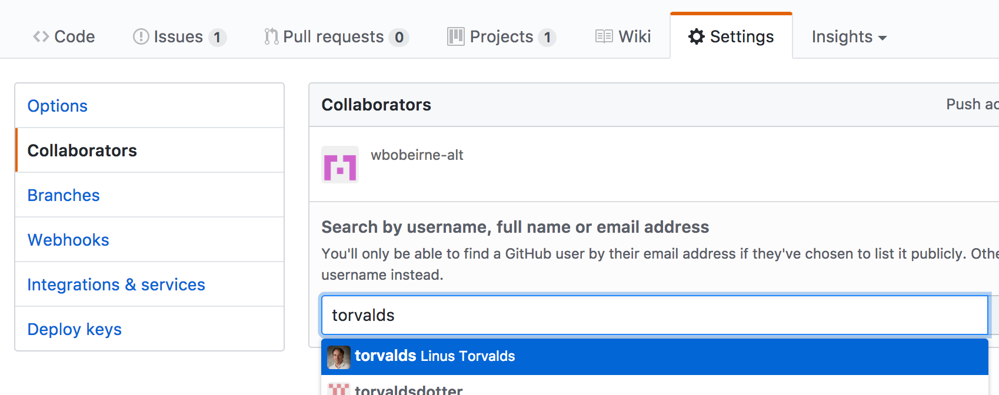
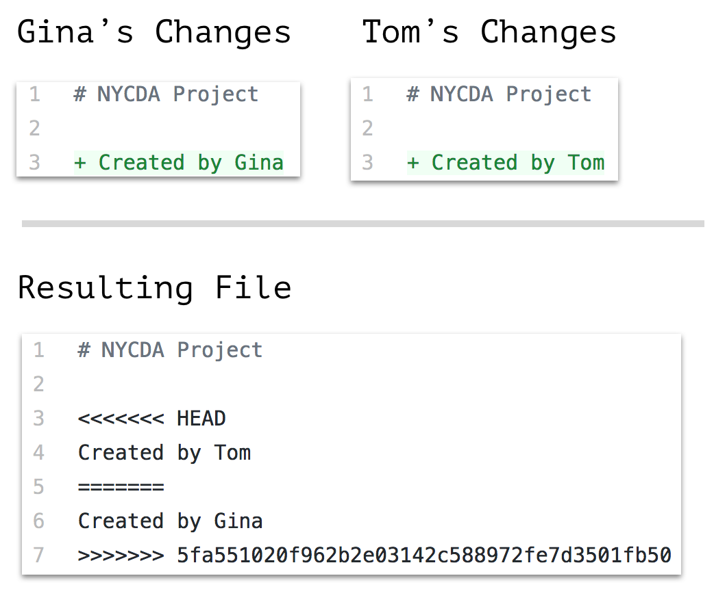
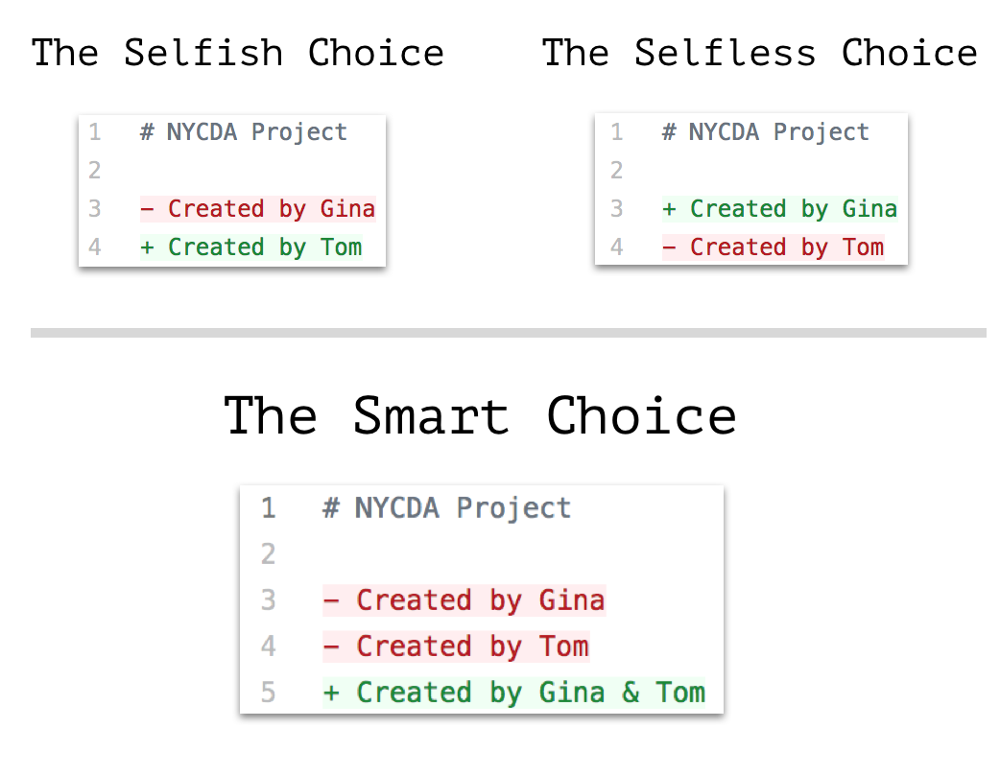
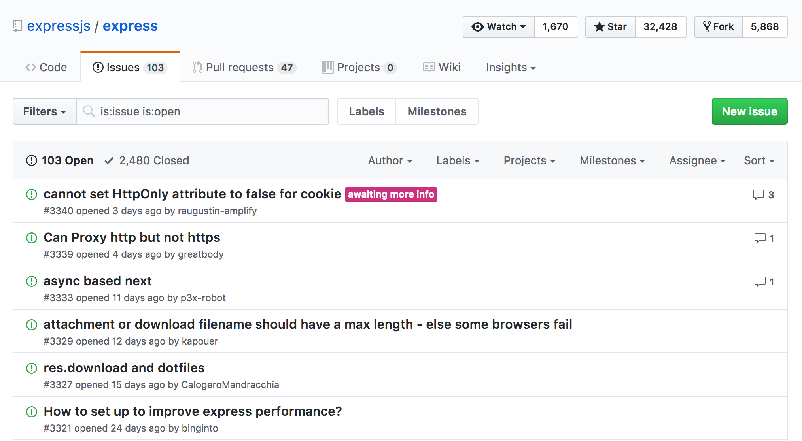
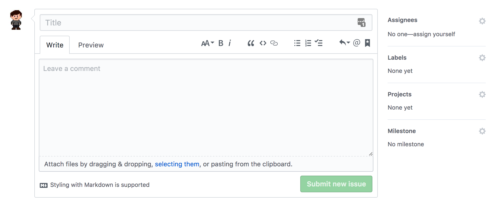
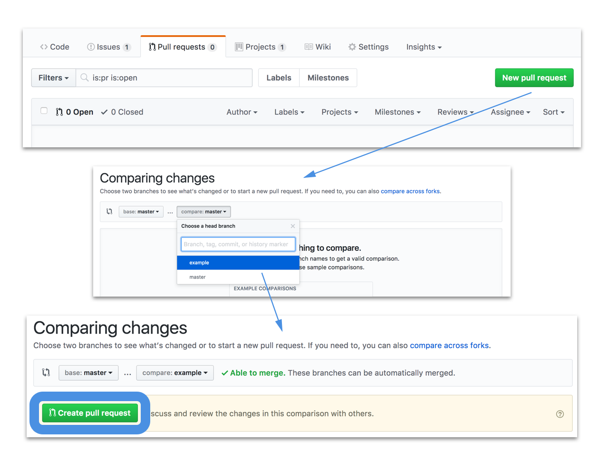
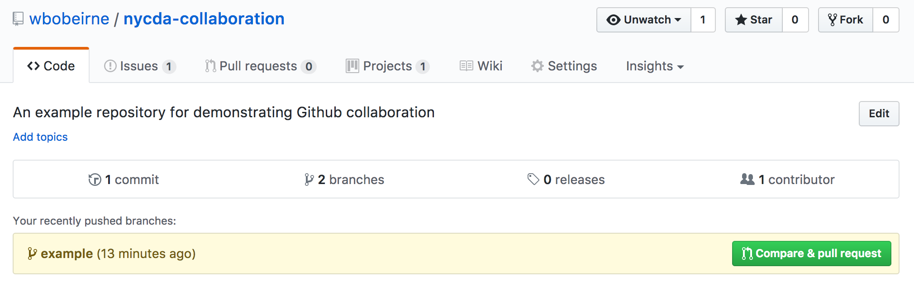
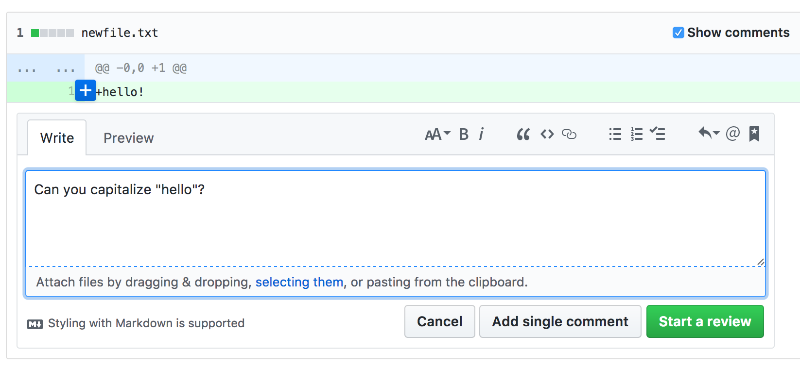
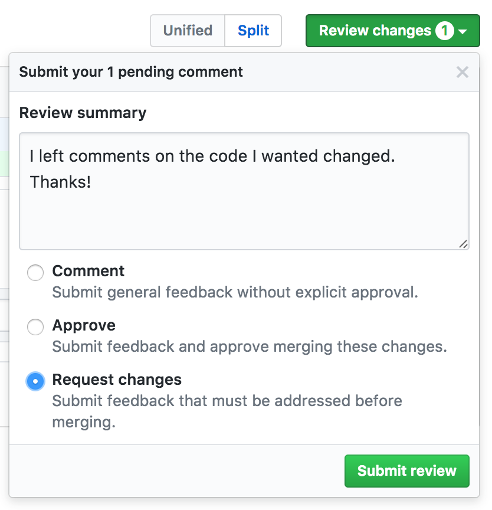
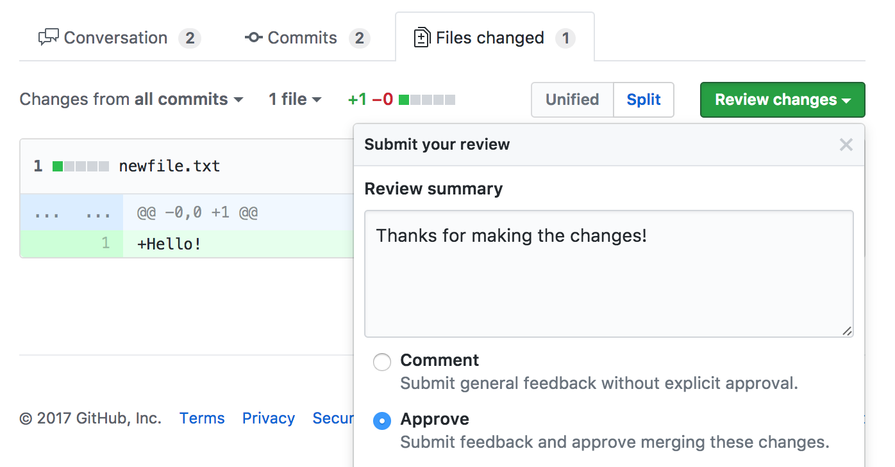

autoscale: true

## Collaborating with Github
### And Other `git` Tools

---

## Our Projects So Far

* When we start a new project, we make a new github repository
* All commits we make go directly into the `master` branch
	* That's why we say `git push origin master`, we're pushing the `master` branch
* When we push our code, it always goes up without conflict
* All of our code only comes from one location: our computer

---

## Adding a Collaborator

* When you work together with someone on a project, you'll want to give them all the access to to repository that you have
* To do so, you'll go to the settings tab on your Github project (Not your account) and click on the "Collaborators" tab
* From here, you can add any Github user to your project by name



---

## Working With Multiple Collaborators

* If "Tom" and "Gina" were to work on a project together, they'd need to have better coordination than just pushing to master whenever they wanted
* If Gina pushed a change to the master branch, and Tom tried to push after her, he would be unable to do so, getting this error:

```bash
$ git push origin master

To github.com:gina/nycda-project.git
 ! [rejected]        master -> master (fetch first)
error: failed to push some refs to 'git@github.com:gina/nycda-project.git'
# hint: Updates were rejected because the remote contains work that you do
# hint: not have locally. This is usually caused by another repository pushing
# hint: to the same ref. You may want to first integrate the remote changes
# hint: (e.g., 'git pull ...') before pushing again.
```

* This is because Git knows that there's work that Tom hasn't updated his project with yet, and that it might conflict with his code
* Tom will need to `git pull origin master` to pull down Gina's changes before pushing

---

## What Happens if There's a Conflict?

* What if Gina's change was to the same file as Tom?

```
$ git pull origin master

From github.com:gina/nycda-project
 * branch            master     -> FETCH_HEAD
   73482ef..5fa5510  master     -> origin/master
Auto-merging README.md
CONFLICT (content): Merge conflict in README.md
Automatic merge failed; fix conflicts and then commit the result.
```

* If Tom opened up README.md now, he'd find that git noted in the file where they conflicted
* It's now up to Tom to decide how the file should be fixed

---

## Conflict State



---

## Conflict Resolution

* Right now Tom's git is in the "conflict merging" state
* The git conflict code we saw before is meant to be a temporary guide to conflicts, **never committed to the repository**
* Tom must now find all the conflicted files (Using `git status`) and resolve each conflict
* He does so by choosing one of the two changes, and commiting them
* Alternatively, he writes new code that incorporates both changes
* It's important to think carefully about which changes you go with, test your choice, then commit, or you will make the person whose code you removed very unhappy

---

## Conflict Resolution (Examples)



---

## Can We Avoid This?

* Ideally we don't run into this conflict state often, because we separate our tasks, and we don't commit directly to master
* We'll cover a couple of tools that Git and Github provide us to make working with other developers easier
* Follow along with this example repository:

### [https://github.com/wbobeirne/nycda-collaboration](https://github.com/wbobeirne/nycda-collaboration)

---

## Tool #1: Github Issues

* Knowing who's working on what at any given time can be difficult
* You can try to coordinate in person or over chat / email, but it's very likely you'll forget
* We also want to be able to plan out future tasks that we haven't assigned yet
* We can do so using **Github Issues**, a task list with assignments and comments

---

## The Issues Page



---

## The Issues Page

* Issues is available under the "issues" tab on your repository page
* Every project has an issues page, no matter how big or small
* From the issues page, you can search for existing issues, or sort and filter the list
* By clicking the "New Issue" button in the upper right, you can also create new issues

---

## Creating an Issue



---

## Creating an Issue

* Issues have a large number of fields, but only the title and description are required
* The **title** should be short, but embody the task as a whole
* The **description** should be _very_ detailed about what needs to be done (i.e. don't say "Implement form", describe all the inputs of the form, what endpoints it'll need etc.)
* You can **assign** the issue for someone to do, or leave it unassigned until you know who's going to work on it
* You can **label** related issues, such as "bug", "enhancement", "nice to have" etc.
	* Github comes with defaults, but you can make your own!
* You can assign issues to **projects** and **milestones** (More on this later)

---

## Tool #2: Branching

* Now that we have issues, we'll want to write code to complete them
* Because issues may take multiple commits to fix, and we may be working on multiple unrelated issues at the same time, we'll want to keep code for each issue separate
* In order to do this, we'll create **branches** in git that stores that code
* When we've completed a branch, we can merge it back in to master and push it

---

## Branch Flow


<br/>
<br/>

_This image taken from the [Github "Hello World" Guide](https://guides.github.com/activities/hello-world)_

---

## Creating a Branch

* Branches are collections of commits that are bundled together
* Branches start by taking all of the commits of your current branch, and making a new namespace for them
* All commits you make will be added to your current branch
* You can make a new branch by running
```
git branch [branch-name]
```
* You can then switch to that, or any other branch, by running
```
git checkout [branch-name]
```
* You can list all of your available branches, and current branch, by running
```
git branch
```

---

## Managing Branches

* Code that you commit to a branch _only lives on that branch_
* If you switch back to master, it will not have the code changes from your branch
* Don't worry though, simply switch back to that branch to get the code back
* But in order to switch branches, you must commit any outstanding changes
* If you meant to have changes on a branch that's not your current one, you can "stash" your changes, switch to the correct branch, and "pop" your changes back out:

```bash
# Currently on `master` branch but I should be on `will-styling`
git stash
git checkout will-styling
git stash pop
```

---

## Finishing Branches

* When you're done editing a branch, you're ready to "merge" it back in
* This takes all of the commits you've added, and puts them back into another branch
* Simply run the following command on the branch you want to have the new commits:

```bash
# On `master` branch
git merge will-styling
```

---

## Finishing Branches (cont.)

* However, much like pulling, you CAN run into conflicts if master has gotten new commits
* Simply merge master into your feature branch first, resolve any conflicts, commit the resolution, then merge in to master
* It's good to merge master back into your feature branch often, so you don't end up with a huge amount of conflicts

```bash
git checkout feature-branch
git merge master
# Fix up any merge conflicts...
git add -A
git commit -m "Fixed conflicts with master"
git checkout master
git merge feature-branch
git push origin master
```

---

## Tool #3: Pull Requests

* While the branches from before were a great thing to do, _manually merging into master and pushing was not_
* This can cause the same frustrating issues as Tom and Gina
* Not to mention, it could be considered rude to commit code without having your partners check it as well
* Fortunately Github gives us **pull requests**, a way of submitting branches for you team to review and aprrove

---

### Creating a Pull Request

* Go to the Pull Requests tab on your repository page
* It looks and functions just like the issues page, with a green create button in the top right
* You'll choose to compare "master" to your feature branch
* Then you'll click "Create" after confirming the changes look accurate
* If things are unable to merge, follow the conflict instructions from before



---

## Creating a Pull Request (Alternative)

After pushing a feature branch, your repo's homepage will have a quick link for making a new PR, which will do everything from before



---

## Describing the Pull Request

* Hitting "Create Pull Request" isnt' the end though, you now need to describe your pull request
* It has the exact same fields as an issue (hint: PRs are just issues with code!)
* Because it's got code, you should be extra thorough in describing:
	* Describe what your code is supposed to solve (Reference the issue)
	* Provide steps to test (Go to this page, run this command etc.)
* Be sure to assign the pull request to a **reviewer**!

---

## Reviewing Pull Requests

* If you're the person who got assigned as a reviewer, you've got a job to do!
* When you open up the Pull Request, you'll be given 3 tabs:
	* **Conversation** - Here you can ask any questions to the requester
	* **Commits** - A list of the commits attached to the request
	* **Files changed** - The actual code changes
* While you'll want to use all 3 tabs, the main one you'll be looking at is Files changed

---

# Reviewing - Run the Code

* The first thing to do is run their submitted code
* Pull down their branch and switch to it, then restart your app
* Try to poke around at what they said they changed, and make sure nothing broke

```bash
# Grab the changes from github
git fetch origin
# Checks out the github version of a branch
git checkout origin/feature-branch
```

---

## Reviewing - Commenting

* Go through the code on the "Files changed" tab and leave any comments you'd like
* Don't be afraid to offend, just be polite, this is something we do in the industry
* Likewise, don't get offended if someone leaves comments, a good developer knows how to take feedback!



---

### Reviewing - Request Changes

* If there were issues in their code, or bugs you found, leave a review with "Changes requested" as the option
* The requester will get an email and a notice on the PR that changes are needed
* They can make and commit the changes, and push the updated branch



---

## Reviewing - Approving

* Once the code looks all good, you can leave an "Approve" review
* From their, either you or the requester can hit "Merge pull request"
* You'll need to pull master again to get the newly merged changes



---

## Branching, Issues, and Pull Requests

* The three concepts we just covered work in tandem:
	* For every feature or bug with your project, you should make an **issue**
	* For every issue that requires a code change, there should be a **branch**
	* Every branch should be reviewed and merged in via a **pull request**, not directly, no exceptions
* A good branch naming scheme is `[name]-[issue-name]`, like `will-form-styling` or `jessie-heroku-refactor`
* For simple things like README updates or typos though, you can do those directly to master, but try not to make a habit of it

---

## Collaboration Etiquette

To make collaborating a smooth process, keep in mind these best practices:

1. Code reviews are a discussion, not demands. Ask questions about someone's code, and make suggestions. Don't try and force someone to make a change, you may very well not understand the code yourself!
2. Check in before committing directly to master. Make sure it won't interfere with someone else's code, and that they'll be ready to pull your changes down.
3. Assign issues to your strengths. Make sure everyone's doing the type of work they do best, and try to divvy up an even amount of work.
4. Communicate frequently! Update your issues if you run in to trouble, and make a slack channel or PM your teammate about your progress.

---

# Challenge: Assign and Review

You've all been added as collaborators to a github project, clone the project now.

1. Make a new issue, and assign it to the person on your left.
	* The issue will tell them to add their information to a json file with their name.
2. You'll receive an issue from the person on your right.
	* Make a new branch that starts with your name, like `will-console-log`.
	* Complete the task, and run the code according to the readme to test it.
	* Commit & push your branch when you know it works.
3. With your newly pushed code, create a pull request and assign it to the person who made your issue (on your right)
	* Describe the changes you made, and tell them how to test it.
4. Request a change to the pull request you've been assigned to review.
	* Ask for any change you want, tell them to add more info, whatever.
5. You'll also receive a change request. Make the changes, and push the branch again.
6. You should receive updated code. Re-review the request, and approve it if it's correct.
	* Once it's approved, you should click the "Merge pull request" button

---

# Additional Reading

* [Git Command Line Cheat Sheet]() - Common commands and workflows for the git command line, reference this!
* [Github's "Hello World" guide](https://guides.github.com/activities/hello-world/) - This covers almost everything we talked about today, step by step
* [Understanding the Github Flow](https://guides.github.com/introduction/flow/) - A cool interactive version of the branching diagram we saw earlier
* [Documenting your projects on Github](https://guides.github.com/features/wikis/) - Tutorial and best practices guide for Readmes and Wikis

---
