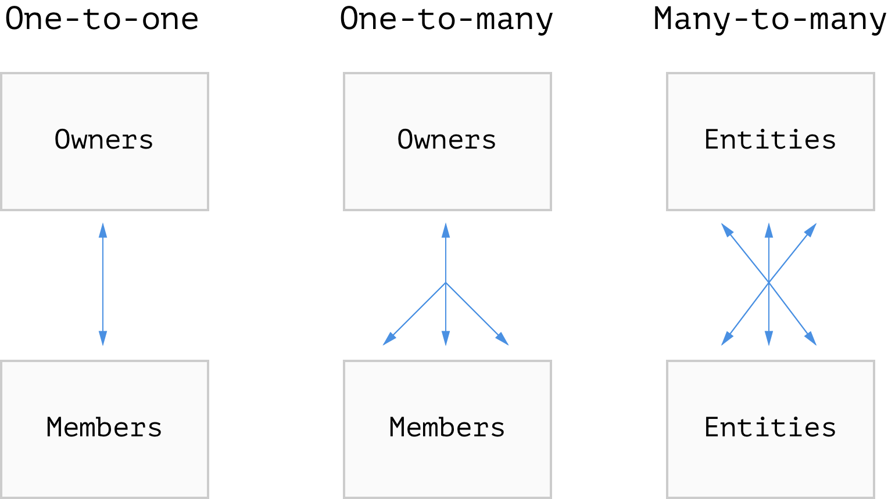

autoscale: true

# Database Relations
## Using Sequelize & Postgres

---

## Our Databases So Far

* We've been representing individual object as tables, storing their attributes as columns
* Most of our projects have only needed a single table that stores all of its information
* Our Sequelize models have been stand-alone, not referencing any other models
* But that's typically not how larger systems work

---

## Real World Problem: Doctor App

* Let's say we had a Doctor app, that keeps track of doctors and patients
* It would make sense to have a `doctors` table, and a `patients` table
* But in addition to their individual traits, we'd also need to store the **relationship** between doctors and patients
* A patient typically goes to see a particular doctor, so we'd want some way to indicate that

---

## Database Relationships

* PostgreSQL and many other databases are often called **relational** databases, because they can express the relationship between entities
* These relationships are referred to as "relations", "links", or "references"
* In order for a relationship to exist, both sides of the relationship **must** have primary keys so that they can reference each other
* There are a few different kinds of relationships:
	* One-to-many
	* Many-to-many
	* One-to-one
* First we'll look at these relationships, then we'll see how to use them in code

---

## Database Relationships - One-to-many

* Most relationships can be defined as having one **owner** of many **members**
* The member's table gets a new **foreign key** column from the owner table
	* A foreign key is a value that matches a primary key from another table
* This allows us to reference the entity in the owner's table that the member belongs to
* Examples of this would be:
	* Todo Lists (owner) have many Tasks (members)
	* Users (owner) have many Photos (members)
	* Photos (owner) have many Comments (members)
* This is the most frequently occurring relationship in a database

---

## Database Relationships - Many-to-many

* Some relationships can be defined as having many references to many other items
* Because of the complex nature this relationship, a third table is created that has a foreign key column for both types of entities
	* This table is often called a cross-reference table, or xref for short
* A foreign key can appear in multiple rows, but no row will have the same two foreign keys
* Examples of this would be:
	* Authors can have many Publications, and vice versa
	* Projects can have many Programmers, and vice versa
	* Students can have many Classes, and vice versa
* These complex relationships do come up, but not as often as one-to-many

---

## Database Relationships - One-to-one

* In a one-to-one relationship, an entity can have one member
* And in reverse, that entity can only reference its one owner
* Examples of this would be:
	* Person to Driver's License
	* Grade to Assignment
	* Bank Account to Owner
* This is a very infrequently used relationship due to its inability to expand, and is often better handled as a one-to-many

---

## Database Relationships (Diagram)



---

## Defining Relationships with Sequelize

* You can have these relationships using raw SQL queries as well, but Sequelize provides a great inferface for this
* Having one model require the other, and define their relationship using functions will handle the table setup for us, and provide us convenient functions for making associations
* This is why we typically refer to things as "owners" and "members", to keep relationships unidirectional

---

## Sequelize: One-to-many with `hasMany()`

* To define a one-to-many relationship, we call `Owner.hasMany(Member)` on the owner's model, and provide it the member's model
* This adds an `<ownerModelName>Id` column to the member's table, that references which row owns it

```js
// models/user.js
const Photos = require("./photos");
const Users = sql.define("user", { /* ... */ });
Users.hasMany(Photos);
```

```bash
# `photos` Table
| id  | photo        | userId |
| --- | ------------ | ------ |
| 382 | 14781251.jpg | 8462   | # User 'Phil'
| 937 | 38292747.jpg | 8462   | # User 'Phil'
| 592 | 38202475.jpg | 4719   | # User 'Violet'
```

---

## Sequelize: Many-to-many with `belongsToMany()`

* To define a many-to-many relationship, we call `Model1.belongsToMany(Model2, options)`, then `Model2.belongsToMany(Model1, options)`
	* We call it twice to enhance both models' instances
* However, we **must** also provide an `options` object with a `through` key, to name the xref table
	* This is because Sequelize was not very good at generating the table name

```js
// models/tag.js
const Article = require("./article");
const Tag = sql.define("tag", { /* ... */ });
Tag.belongsToMany(Article, { through: "article_tags" });
Article.belongsToMany(Tag, { through: "article_tags" });
```

```bash
# `article_tags` table
| articleId | tagId |
| --------- | ----- |
| 4828872   | 37    | # Tagged 'News'
| 4828872   | 59    | # Tagged 'Politics'
| 68292938  | 37    | # Tagged 'News'
| 68292938  | 108   | # Tagged 'Weather'
```

---

## Sequelize: One-to-one with `hasOne()`

* To define a one-to-one relationship, we call `Owner.hasOne(Member)` just like `hasMany()`
* The member table will receive an `<ownerModelName>Id` column that is unique
	* This means you couldn't have two members that refer to the same owner

```js
const Customer = require("./customer");
const Account = sql.define("account", { /* ... */ });
Account.hasOne(Customer);
```

```bash
# `customer` table
| id      | name     | accountId |
| ------- | -------- | --------- |
| 3824892 | "Sean"   | 8191840   |
| 9372213 | "Jean"   | 5829103   |
| 5924929 | "Sawyer" | 29482948  |
```

---

## Using the Relationships with Sequelize

* In addition to adding columns to tables, defining these relationships gives our model instances new methods
* One-to-one relationships can **set** a link on an existing entity, **create** a new linked entity, and **get** their linked entity
* \*-to-many can do all that, as well as **add** additional linked entities, check if it **has** a link to an entity, and **count** how many links it has

---

## Sequelize: Set a Relation

* After defining any relationship, your model instances will be given an `instance.set<ModelName>(instance)` or a `instance.set<ModelNames>(instances)` method
* Simply call the function on one instance of the model, and pass it an instance or array of instances, depending on your relationship, and it will add the foreign key in the right place
* Note that in \*-to-many relationships, anything not passed to the set function **will be unassociated**, so we typically don't use this
	* However, you can remove all associations by passing empty array!

```js
// One-to-one
function associateAccount(customer, account) {
	return customer.setAccount(account);
}
```

---

## Sequelize: Add / Remove Relations

* In a \*-to-many relationship, we can add and remove relations using an owner instance
* We're given `add<ModelName>(instance)` and `add<ModelNames>(instances)` methods that take in one instance, or an array of instances, to add relations to
* Likewise, we also get `remove<ModelName>(instance)` and `remove<ModelNames>(instances)` methods
* Unlike the set methods, these won't alter any other relationships than the ones you specify

```js
// Many-to-may
Tag.findAll(where: { name: "News" }}).then(function(tag) {
	Article.searchTitles("Breaking:").then(function(articles) {
		tag.addArticles(articles);
	});
});
```

---

## Sequelize: Create New Relations

* While we could create an entity, then add the relation, but it's much faster (and sometimes required) to create the new entity _using its owner_
* We're given a `create<ModelName>` function that will create a new instance of the `<ModelName>` model, and associate it to the instance we called the method on

```js
// One-to-many
Todo.findById(req.params.todoId).then(function(todo) {
	todo.createTask({ name: req.params.taskName });
});
```

---

## Sequelize: Get / Count Relations

* If we want to retrieve an instances relations, we can do so using `get<ModelName(s)>` on owner instances
* If we only need the number of relations, we can use `count<ModelName(s)>` instead
* Both functions take in an optional object where you can specify a where clause

```js
// Many-to-many
return student.getClasses({ where: {
	subject: "Math",
}}).then(function(classes) {
	console.log(student.get("name") + "'s Math classes:", classes);
});
```

---

## Note: Instance Arguments

* In any of these methods, where an argument is supposed to be an "instance" of a model, you can alternatively provide the primary key
* This means the unique id generated for the row, NOT a different unique field like username or email

```js
// These two do the same things, the ptwdi class
// instance's ID is 38193185915
student.addClass(ptwdiClassInstance);
student.addClass("38193185915");
```
