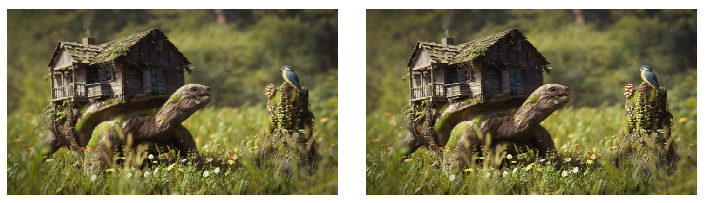
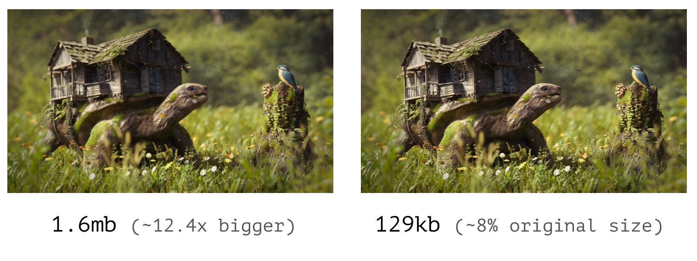
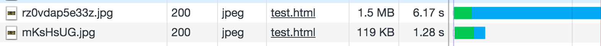
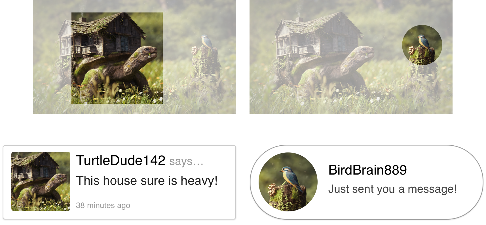

autoscale: true

# Uploaded Image Manipulation
## Making User Photos Fit to Serve

---

## Where We Are Now

* We've implemented `multer` to allow for users to upload files to our server via multipart form POSTs
* We've stored the file's names in our database to refer to later
* We've moved those files into our static assets folder, so that we could serve them up over HTTP
* While this works for all documents in a generic way, we often want to handle images in a special way

---

## Problems with User Images

* When a user provides an image, often times we want to display it on our site somehow
* However, we have no control of _what_ image a user uploads
	* It could be a huge professional camera photo, on the order of megabytes
	* It could be a tiny pixelated photo, too small for our needs
	* It might be too tall or wide for our needs, not fitting the template
* For all of these cases, we'll need to manipulate the image (Or outright reject it) to make it fit for serving to other uses

---

## Problems with User Images - Large Photos

* To emphasize the issues with photos that are too large, let's look at a couple of examples
* Here we have two photos that look pretty identical for this slide (~300px tall)



---

## Problems with User Images - Large Photos

* However, one was sized down to the ~300px tall size we're rendering at, the other was served at its original size
* Look how big the size difference is!



---

## Problems with User Images - Large Photos

* And this is what it looks like loading a page with them on a 3G phone connection. We're wasting user time and data.




---

## Problems with User Images - Large Photos

* We also often want just a small part of the image, or a specific aspect ratio
* Cutting out those pieces can lead to much smaller images that fit better in our template



---

## So How Do We Fix This?

* The idea here is that while we receive _one_ image from the user, we'll take that source image, compress it, and size it down to _multiple_ different versions of itself
* We'll have different sizes for different use cases:
	* Small photos for thumbnails
	* Medium photos for list pages
	* Large photos for when it's the main focus
	* Cropped photos (like profile squares) if our template needs them

---

## Introducing `jimp`

* There are many modules for image manipulation (`node-canvas`, `gm`, `node-imagemagick`) but the one we'll focus on today is `jimp`
* `jimp` is the Javascript IMage Processor
* It allows us to read in an image file, make manipulations to the image, and then save a new version of the file in a new location with those changes
* It can do simple manipulations like resizing and cropping
* It also has the ability to do more advanced things like rotating, altering colors, grayscaling, and much more

---

## Using `jimp` - The Basics

```bash
# In your terminal
npm install --save jimp
```

```js
// In javascript
Jimp.read("path/to/original/image.png").then(function(img) {
	// Make a 100x100 image out of the image, cropping to fit
	img.cover(100, 100);
	// Compress the photo down to "80%" quality
	img.quality(80);
	// Save the image in the assets folder, return the promise
	return img.write("assets/user_images/image.jpg");
});
```

---

## Using `jimp` - Multiple Images

* If you want to make multiple versions of an image, you can with one read
* Just make sure you _return the image_ before chaining another `.then()`
* Any manipulations you make to the image will carry over, so no need to adjust quality each time

```js
const imagePath = "assets/user_images/";

Jimp.read("path/to/original/image.png").then(function(img) {
	// Full size, lightly compressed
	img.quality(80);
	return img.write(imagePath + "image-full.jpg");
})
.then(function(img) {
	// Large size for list pages
	img.cover(400, 400);
	return img.write(imagePath + "image-large.jpg");
})
.then(function(img) {
	// Small size for thumbnails
	img.cover(100, 100);
	return img.write(imagePath + "image-small.jpg");
});
```

---

## Side Note: Crop vs. Resize

* The examples above used the cover function, which resizes _and_ crops
	* This forces an aspect ratio, examples before being a 1:1 ratio
* However sometimes we want to resize, but keep the aspect ratio
* To do this, we use the `resize(width, height)` function and `Jimp.AUTO` to handle the dimension we don't specify

```js
// Resizing
img.resize(200, Jimp.AUTO); // Create a 200px wide image, automatic height
img.resize(Jimp.AUTO, 400); // Create a 400px tall image, automatic width

// Resizing & Cropping
img.resize(300, 300); // Resize to 300x300, but stretches! NEVER DO THIS!
img.cover(300, 300); // Resizes to 300x300, and crops. DO THIS INSTEAD!
```

---

## Side Note: Image Types

* There are many different image types, but we're saving all of our `jimp` images as jpg's. There are many image types that we use for different reasons:
	* **JPG** - This is the most compressable and performant image type, it's great for real life photos because compression is less noticeable.
	* **PNG** - This is a lossless format, meaning it's always pixel perfect, and therefore the largest. This is best for things like logos or other assets.
	* **SVG** - This format is actually code, not binary data. Instead of defining each and every pixel, it's a set of instructions on _how_ to draw an image. It's the best format for flat graphics, like icons, and can scale infinitely large. They are limited in their ability to do certain shapes or color output.
	* **GIF** - This format is used for animated images. It is terribly unperformant, is limited to 128 colors, and should be avoided whenever possible.
	* **TIFF, RAW, BMP** - Commonly coming from cameras directly, these formats are all full quality and uncompressed, should _never_ be used for display on a website.

---

## Side Note: Image Types (tl;dr)

* **JPG**: Use for real world photos, often for user uploaded photos
* **PNG**: Use for pixel-perfect assets, user images if they need to be uncompressed
* **SVG**: Use whenever possible for your assets instead of PNG, typically flat graphics
* **GIF**: Animations only, avoid otherwise
* **TIFF, RAW, BMP**: No.

---

## Using `jimp` In Our Models

* Using `jimp` is just like copying to assets, we can make a model method to do it all

```js
// models/image.js
const Image = sql.define("image", /* columns */);

// This function saves an image to the database, and
Image.saveAndCompress = function(file) {
	return Image.create({
		id: file.filename,
		name: file.originalname,
	})
	.then(function() {
		// Save a compressed version of the image file in static assets folder
		return Jimp.read(file.path).then(function(img) {
			img.quality(80);
			return img.write("assets/uploaded_images/" + file.filename + ".jpg");
		});
	});
};
```

---

## Using `jimp` In Our Models (cont.)

* In addition to saving, it's also a _really good idea_ to add a model instance method for linking to those images
* This makes it so you can change the way images are stored at any time, without having to change your template code

<br/>

```js
// Continuation of models/image.js
Image.prototype.getImageSrc = function() {
	return "/uploaded_images/" + this.get("id") + ".jpg";
};
```
```html
<!-- views/image.ejs -->
"/>
```

---

## Challenge: DropDox Thumbnails

* We're going to expand on DropDox from the previous lesson
* Now when people upload an image, we're going to generate a thumbnail and preview for it
* Download the updated github project below, and follow the readme to finish out the implementation
* Feel free to re-use your .env and database from before, all of the models are the same

[https://github.com/wbobeirne/nycda-dropdox-challenge/tree/thumbnails](https://github.com/wbobeirne/nycda-dropdox-challenge/tree/thumbnails)

---

## Additional Reading

* [GIF, PNG, JPG or SVG. Which One To Use?](https://www.sitepoint.com/gif-png-jpg-which-one-to-use/) - Useful guide for knowing which image type to use
* [`jimp`'s Docs](https://github.com/oliver-moran/jimp) - TONS of useful information in here, read this if you want to use `jimp` in interesting ways!
