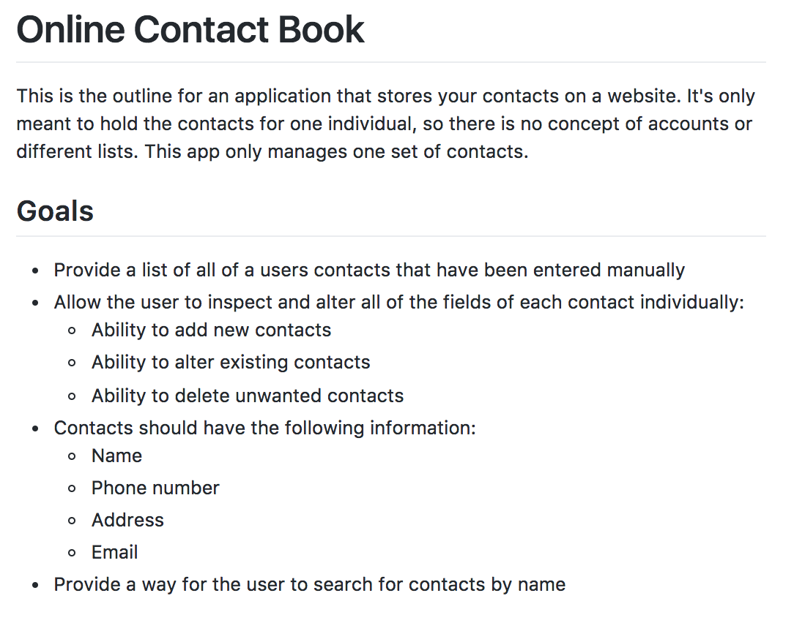
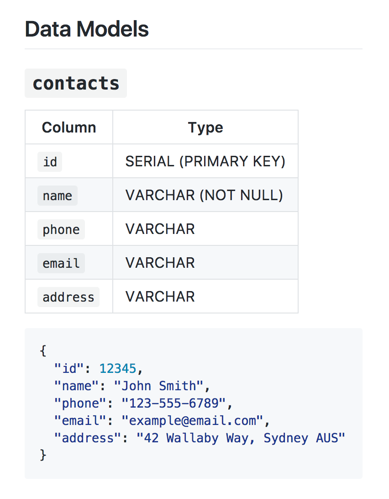
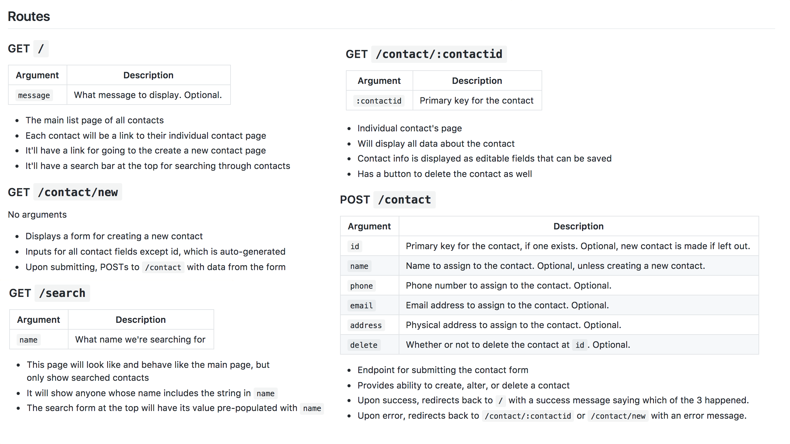
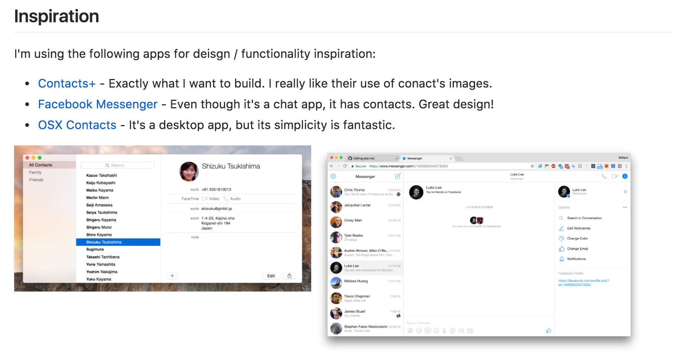

autoscale: true

# Starting a Project with a Developer's Mindset
### A brief break from coding

---

# Planning a Project

* When we start projects, we're often tempted to start coding immediately
* After all, we're developers right? We work with code.
* However, your project should start long before you write your first line of code
* We're going to talk about how you should think about, and plan your projects, before you even open your editor

---

### Step 1: Define Your Project

* Before you start working, you need to know what you're working on
* A brief outline of what you're building is usually a good idea (This is typically provided with your assignments)
* You'll want to expand on that with a list of goals or features you'll need to make for your app to be complete
* While grading criteria is often provided, sometimes they don't cover all of the features in the description. You may need to add some of your own criteria as well.

---

### Step 2: Outline Your Models

* From your goals, you'll want to define every entity you'll need for your application
* Defining your data models upfront is really important, as you don't want to have to change them along the way
* It's best to define what their databse schema will look like, and provide an example JSON object of one of them so you'll know what it should look like

---

### Step 3: Outline your Routes

* Now that you know the data, and have goals in mind, you'll want to outline what your site or app looks like
* You should define each page, if it takes any arguments, and what its responsibilities should be
* Everything you outlined in Step 1 should be reflected in at least one of these pages
* Each route should be a bite-sized chunk that you can work on individually
* If any one page / route seems overly complicated, see if you can split it out in to multiple

---

---

### Step 4: Find Inspiration

* It's very rare that any application you're working on is 100% original, so you should try to find inspiration from other apps
* That's not to say you should just _copy_ other work, but you can see how other people have solved similar problems
* Make a list of things you can refer to, and why you like them
* You could also take some screenshots or other imagery that you want to base your design off of

---

---

## This planning doc is available at:
#### [https://gist.github.com/wbobeirne/65eb451f3b62c1c482fb896ca4b18400](https://gist.github.com/wbobeirne/65eb451f3b62c1c482fb896ca4b18400)

---

# Beginning to Code

* So now we have a kick-ass, thorough plan. We're should be ready to code, right?
* But where do we start? It may be overwhelming to try to tackle this all at once.
* We'll want to employ some techniques to make this project more manageable.

---

## Technique 1: Bite Sized Pieces

* Even a small project like our contact app results in a ton of code and scaffolding
* If we try to write it all at once, we'll run in to dozens of errors
* And what if our plan changes? Or we find out our model needs more / differently structured data?
* Writing code in smaller pieces keeps us from feeling overwhelmed and lost, and makes changing core parts of our project (like the data model) less of a daunting task
* If a function is more than **15 lines of code**, it's probably too long and you should break it out in to more functions
* If a file is more than **80 lines of code**, it's probably too big and you should make isolated, reusable modules that it imports

---

## Technique 2: Run Early and Often

* Writing code in smaller pieces doesn't do you much good if you're not running it frequently. You should run our project after _every single change_.
* If you run in to an error when you run, _resolve it immediately before adding more code_. Leaving that error will only make it harder to solve later.
* If you can't run your code after making a small change because it requires more changes elsewhere, _this means your code isn't bite-sized and modular enough_.
* **You shouldn't write more than 20 lines of code without running it.**

---

## Technique 3: Write Independent Modules

* Every part of your project can be turned in to individual modules that have everything they need either passed in via functions, or imported via other modules

---

## Technique 4: Commit Individual Pieces

---

## Technique 5: Manage Your Time

* The developer's mindset isn't one that we sit in all the time, at least initially
