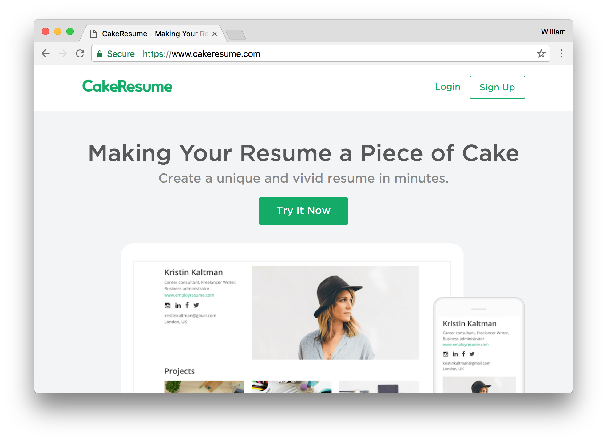
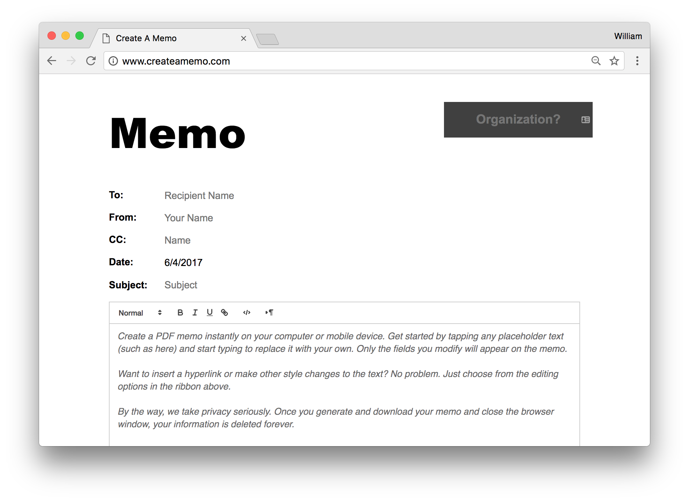
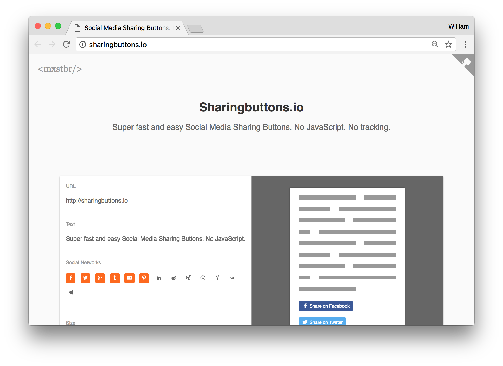

autoscale: true

## Making a Project Portfolio Ready

---

## Core Concept

* While we wish it were, writing good code isn't all it takes to have a good portfolio projects
* Recruiters and tech teams look for candidates who not only know how to code, but know how to organize and present
* Just like any other job, you'd want to demonstrate proficiency in more than just the technicals
* We'll cover a few things that can make your portfolio projects shine

---

## 1) Detailed Readme

* The first thing you see on a github project (besides the files) is your project's readme
* This file that sits in the root of your folder should explain what you made:
	* The name of your project
	* A brief overview of what it does
	* Steps to install
	* Where to see it _without_ installing
	* If it's a library, and not an app, code samples
* While those are mandatory, a few great additions to make you stand out are:
	* An overview of the how the project is organized (file tree)
	* List of technologies used
	* Todos, or what you could expand on
	* An image of your project (if applicable)
	* FAQs

---

## 1) Detailed Readme - Further Reading

* [How to Write a Readme That Rocks](https://m.dotdev.co/how-to-write-a-readme-that-rocks-bc29f279611a) - Geared towards libraries rather than apps, but still some great advice
* [How to Write a Good Readme (And Why You Should Care)](https://thejunkland.com/blog/how-to-write-good-readme.html) - Short and sweet, also geared towards libraries, but also good advice
* A bunch of great READMEs:
	* [Jasonette](https://github.com/Jasonette/JASONETTE-iOS?hn)
	* (Evilpass)[https://github.com/SirCmpwn/evilpass?] - Short, simple, but hits all the marks

---

## 2) Working Demos

* Not everyone who reviews your portfolio is a developer
* Some recruiters don't even look at the github, they jump straight to your projects
* Any web project you list should have a way to run it _without them downloading anything_
	* If it's a static site or library, you can use github pages to host it or documentation of it
	* If it's a dynamic webapp, it should be on heroku
	* If the site has authentication, provide a test login / password on your portfolio or readme
	* It's also good to pick a real name for your heroku apps, rather than keep the default "calming-mountain-13718" urls
* For any group projects, you should probably each have your own hosting locations so that you don't rely on each other to keep your portfolios in shape

---

## 2) Working Demos - Further Reading

* [Github Pages](https://pages.github.com/) - What these are, and how to use them. Make sure you check out the instructions for "Project site"

---

## 3) Splash Page

* While we're all intimately familiar with what the projects we make our, recruiters won't be
* Having the homepage of your apps just be a login form, or some other opaque interface makes it difficult to assess
* Treat your projects like companies, sell potential onlookers on what you built, and explain how to use it
* Think of this page as like a non-coder's README.md

---

_[cakeresume.com](https://cakeresume.com)_

---

_[creatememo.com](http://creatememo.com)_

---

_[sharingbuttons.io](http://sharingbuttons.io)_

---

## 4) Don't Ignore Design

* Design, beyond being usable, isn't a factor in grading projects
* And maybe you're not aiming to be a designer, but that doesn't mean potential employers don't care
* Design doesn't mean fancy animations or graphics, it just means something that looks pleasant and approachable
* If this isn't your strong suit, look into CSS frameworks
	* While I've advised against Bootstrap before, it beats no styling
	* But there are tons of more unique looking alternatives to it!

---

## 4) Don't Ignore Design - Further Reading

* A bunch of non-Bootstrap, smaller CSS frameworks:
	* [Skeleton](http://getskeleton.com/)
	* [Spectre](https://picturepan2.github.io/spectre/index.html)
	* [Picnic](https://picnicss.com/)
	* [Bulma](http://bulma.io/)
	* [Pure](https://purecss.io/)
* ["Design Basics" Class Slides from March](https://github.com/wbobeirne/lesson-modules/blob/master/modules-4-9-design-basics/design-basics.pdf)
* [Web Design in 4 Minutes](http://jgthms.com/web-design-in-4-minutes) - For rolling your own, fun interactive article on all it takes to make a website feel designed
