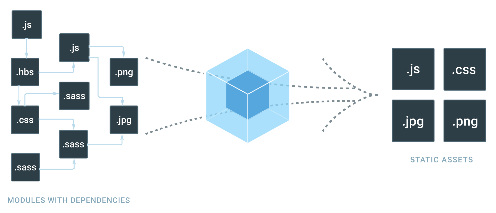
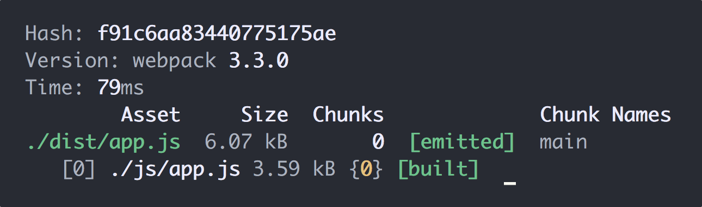
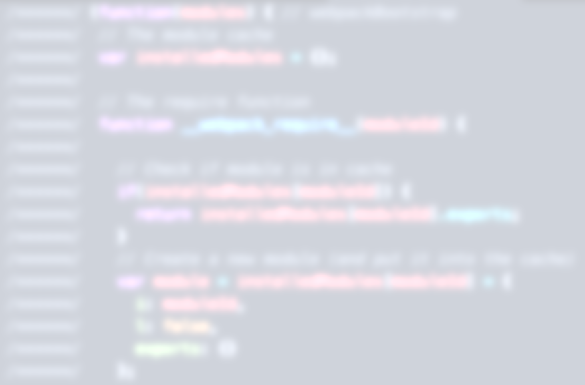

autoscale: true

# Intro to Webpack
## Asset Pipeline & Bundler

---

## Client Side Assets Now

* The way we write javascript to run on the client's computer right now is pretty unstructured
	* We write a bunch of files that are only included on some page
	* If they depend on each other, we have to load them in the right order
	* If they depend on a library (jQuery, moment, etc.) we have to load those too
* We've also lost a lot of the nice things we had in node
	* Writing modular code that could be easily reused
	* The ability to `require` other modules as dependencies
* What we want is to be writing that node style of code for our client side scripts

---

## Introducing Webpack



---

## What is Webpack?

* Webpack is an asset pipeline and bundler
* What this means is that all assets that will end up on a client's computer (JS, CSS, images, fonts etc.) are run through a common process
* They can then be altered in a way that will run best on a user's computer
* Webpack itself doesn't do these alterations, it just provides the pipeline

---

## Setting up Webpack

* Webpack is primarily a command line utility
* It uses a configuration file to determine what files it takes in, what it does to them, and how it should output them
* While our config files will eventually get fairly complex, we'll start simple
* Let's make a configuration that simply takes in one javascript file, and outputs one javascript file

---

## Webpack Config

```js
// webpack.config.js
module.exports = {
  entry: './js/app.js',
  output: {
		path: './dist',
    filename: 'app.js',
  },
};
```

* The config is just a javascript object with some particular keys
* The `entry` key tells webpack what script file to take in
	* There can be multiple entries if needed, but we'll start with one
* The `output` key is an object that tells webpack how to output the entry file
	* `path` is what folder it will go in, we often call this `dist`
	* `filename` is what the output js file will be called

---

## Running Webpack

* First we need to install the npm module `webpack`
* Next we need to add a script to `package.json` that runs webpack with our config and watches for changes
* Finally we run the newly added webpack script

```bash
# In your terminal
npm install --save webpack
```

```js
// package.json
{
	// ...
	"scripts": {
		"start": "webpack --watch --config=webpack.config.js"
	},
	// ...
}
```

```bash
# Back in your terminal
npm start
```

---

## Running Webpack - Output



* `hash` is a hash of all of webpack's output (More on this later)
* `version` is just the version of Webpack
* `time` is how long it took webpack to run, very fast for a simple config
* Below all of that is a table of webpack's output, and what each file is composed of
	* Right now it's just one file out, from one file in, so nothing too crazy

---

## Now Let's Look at the Output



---

## What's Going on in Here?

* At the top of the file is all of webpack's "boilerplate" for loading individual files
* Webpack puts each file in an array of functions as modules
* Files can now call `require` on each other
* This causes webpack to run the function for that file, and return whatever was `module.exports`'d
* This causes our frontend code to behave just like node!

---

## Now Let's Require a File


---

## Using NPM Modules

* Splitting out our own code is great, but the best part of node development was writing _less_ code by using node modules
* Webpack also brings that ability to us
* Popular client-side javascript can also be found on `npm` and installed via the command line
* Let's install the `jquery` module and require that on our project too

---

## Some Minor Cleanup

Now we'll need to fix up some parts of our project

1. Our script tagwill now need to src `"/dist/app.js"`
2. We'll want to remove the other script tags we had before, we only need one now
3. We'll want to gitignore the `dist/` folder, we NEVER check in compiled assets

---

## Upcoming Webpack Stuff

* What we learned was pretty handy, but webpack can do so much more
	* Providing new features to JS, or new languages that compile to JS
	* Optimizing and minifying our Javascript for production builds
	* "Hot" loading our code to update in real-time (No refreshes!)
	* Bundling other things like HTML, CSS, and more
	* Optimizing our images as a part of the bundling process
* We'll learn much of this together, but there's a lot out there to find

---

## Additional Reading

* [Webpack's official site](https://webpack.js.org/)
* [Webpack's getting started guide](https://webpack.js.org/guides/getting-started)
