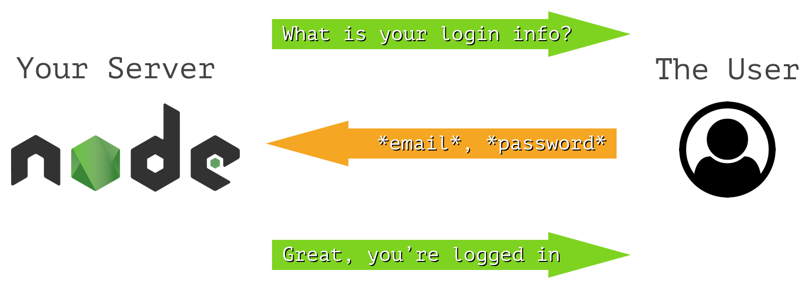
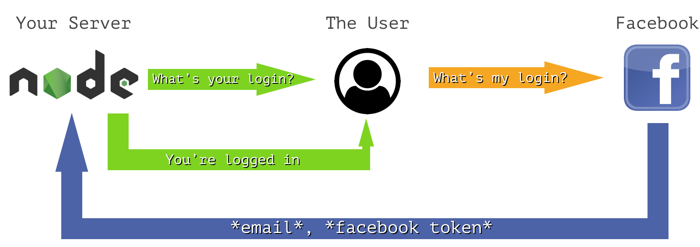
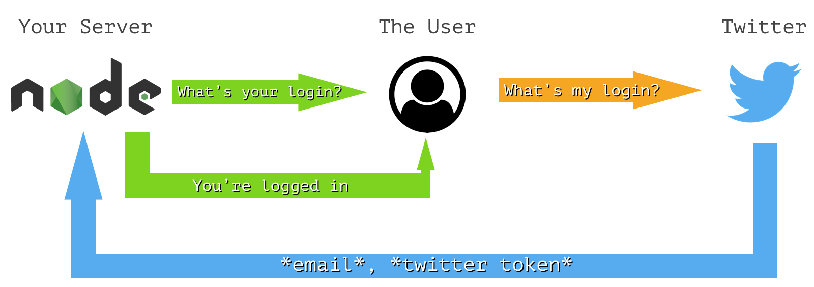
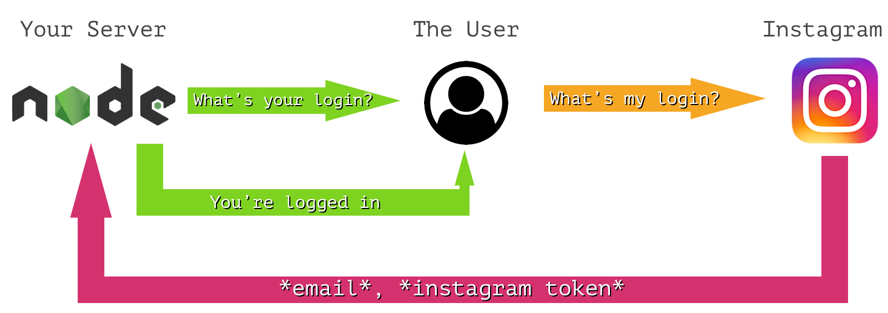

autoscale: true

# Passport JS
## User Authentication Strategies

---

## Authentication So Far

* We've typically been making a `users` table that has some a unique system ID, a unique user-made ID (username, email) and a password
* We secured the password using bcrypt to hash the password
* Users are then able to supply the unique user-made ID and password, and we can log them in
* We store their ID in the session that we later deserialize and attach to `req.user`
* But what about other ways of login?

---

## Login Strategy: Database ("Local")



---

## Login Strategy: Facebook



---

## Login Strategy: Twitter



---

## Login Strategy: Instagram



---

## Login Strategies

* As we can see, the flow is _very_ similar between third party logins
* But it's also the same concept as our database login!
* A user-made unique ID (email) and some kind of secure unique identifier (password, social ID) is sent to the server, to confirm the user is who they say they are
* The different login processes are known as **strategies**, but they all have the same end goal: Confirm they are the user, and set the session to that user
* In order to make these disparate flows use the same system, we'll use the **Passport** module

---

## Passport

```
npm install --save passport
```

* Passport is a module that manages a common way for these strategies to communicate
* The flow is always: Confirm the user, find that user in your data store, and save something that can serialize and deserialize that user easily
* Passport itself doesn't implement any of the strategies we talked about before, it's just a framework
* But there are modules for all of the strategies shown before, and more

---

## Passport Setup

* Typically we'll make one file that handles all passport strategies in `util/passport.js`
* This file will handle:
	* Having one common instance of `passport`
	* Defining all of the strategies we'll use
	* Providing functions for serializing and deserializing a user

---

## Passport Setup - Basics

```js
// util/passport.js
const passport = require("passport");

/* Define startegies here */

/* Define de/serialization here */

module.exports = passport;


// app.js
const passport = require("./util/passport");
app.use(passport.initialize());
app.use(passport.session());
```

* Passport requires no instantiation, like Sequelize or Sessions
* Instead, it's a configurable singleton whose methods are customized

---

## Passport Strategy - Local

```
npm install --save passport-local
```

* All strategies are separate modules
* The one that deals with a "local" database that holds a username / password is `passport-local`
* We will tell passport to "use" this strategy (Much like an express middleware) and define how it should handle a login request to authenticate the user

---

## Passport Strategy - Local (Code)

```js
// util/passport.js
const User = require("../models/user");
const LocalStrategy = require("passport-local").Strategy;

passport.use(new LocalStrategy(/* [options], strategyHandlerFn() */));
```

* Each strategy defines a function that takes in what the strategy requires, and authenticates the user from there
* You can also optionally pass a configuration object first, more on that later

---

## Passport Strategy - Local (Code)

```js
// util/passport.js
passport.use(new LocalStrategy(function(username, password, done) {
	User.findOne({ where: { username: username }})
		.then(function(user) {
			if (user) {
				user.comparePassword(password).then(function(isValid) {
					if (isValid) {
						done(null, user);
					} else {
						done(new Error("Invalid password provided"));
					}
				});
			} else {
				done(new Error("That user does not exist"));
			}
		})
		.catch(function(err) {
			// Our User.findOne failed, which means something is very wrong
			console.error("Database error in local strategy", err);
			done(err);
		});
}));
```

---

## Passport Strategy - Using Local

```js
// routes/auth.js
const passport = require("../util/passport");

router.post("/login", passport.authenticate("local"), function(req, res, next) {
	passport.authenticate("local", function(err) {
		if (err) {
			// Re-display login with an error
		}
		else {
			// Redirect to whatever page
		}
	})(req, res, next);
	res.redirect("/home");
});
```

* Passport provides an `authenticate` function where you specify which strategy you want to implement, and a handler function
* This function returns a middleware function though, but we'll want to handle it in a custom manner
* So we'll call it passing all of the middleware arguments ourself
* The `"local"` strategy expects `req.body` arguments of `username` and `password`

---

## Passport Strategy - Configuring Local

```js
// util/passport.js
passport.use(new LocalStrategy({
	usernameField: "email",
	passwordField: "password",
}, function(email, password, done) {
	/* ... */
}));
```

* If you don't use `req.body.username` and `req.body.password`, you can change those in the config argument
* Here we use email instead of username

---

## Passport - De/Serialization

* Now that we're passing the `user` object to this `done()` function, we'll need to implement the part that stores the user in the session
* Passport stores a single string to represent the serialized user
* It then passes that string to a function for deserialization on subsequent requests
* These functions are provided by passing them to `passport.serializeUser()` and `passport.deserializeUser()`
	* These are methods that take in functions, _NOT_ keys we redefine
* Passport will then attach the results of `deserializeUser` to `req.user`, just like we've been doing

---

## Passport - De/Serialization (Code)

```js
// util/passport.js
passport.serializeUser(function(user, done) {
	done(null, user.get("id"));
});

passport.deserializeUser(function(id, done) {
	User.findById(id).then(function(user) {
		if (user) {
			done(null, user);
		}
		else {
			done(new Error("Unable to find user with passport session"));
		}
	}).catch(function(err) {
		console.error("Error deserializing user", err);
		done(err);
	});
});
```

---

## Passport - Login and Logout

* Beyond just re-implementing everything we've done before, Passport adds some new functionality
* The `req` object will now have `login(user, callback)` and `logout()` functions attached to it for any custom flows we want
	* Logging the user in after signup
	* Allowing for an admin page to login as anyone
	* A `/logout` route for signing out
	* Forcing a logout after a user changes their password

---

## Passport Strategies - Third Party

* _Phew_, that was a lot of setup to get the same behavior we had before
* But now we can implement other strategies that will re-use a lot of what we just made
* By either adding new columns to the user table, or an xref table for social tokens, we can define a similar strategy for any social service that looks up the user, and serializes them to our session
* I won't walk through the code for these other strategies in class, but I've provided an example project that implements a few of them here:

[http://www.url.com](url)

---

## Challenge - Convert to Passport

* We're going to take our DropDox project from before and convert it to use Passport
* This will require us to:
	* Download the `passport` and `passport-local` modules
	* Create `util/passport.js` and require / export `passport`
	* Replace our custom deserialize middleware with `initialize()` and `session()` middlewares
	* Create a `new LocalStrategy` for our users
	* Define how to serialize / deserialize given a user / userid
	* Use the `passport.authenticate("local")` middleware for our login instead of our custom one
	* Don't forget to change any `req.session.userid` to `req.login` / `req.logout`
